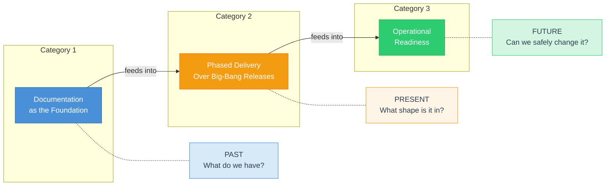
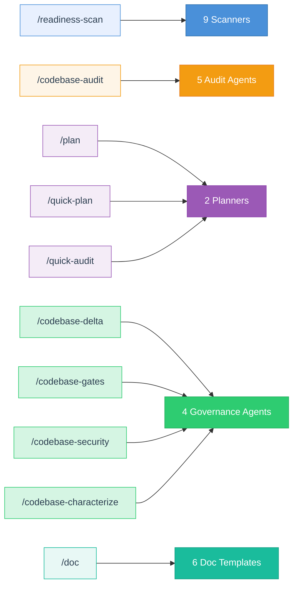
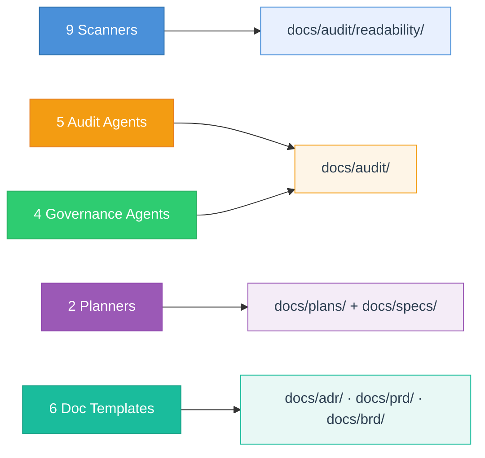
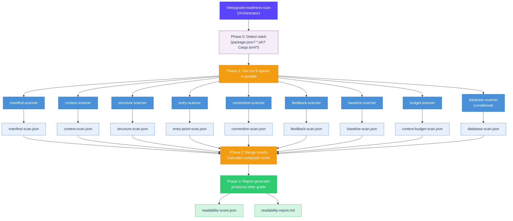
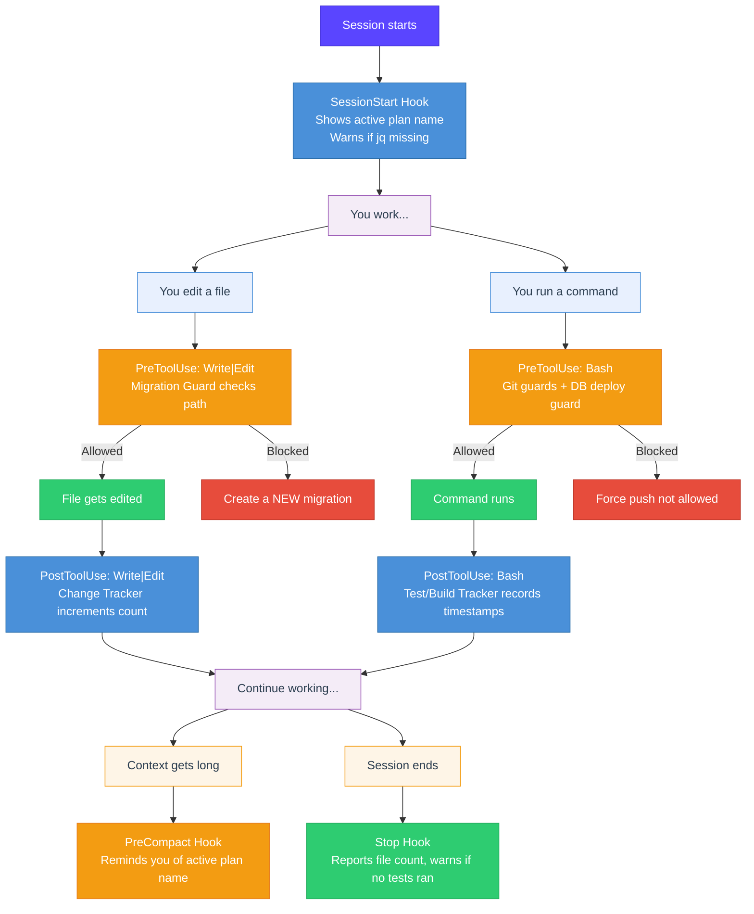

<div align="center">

# DeepGrade Knowledge Guide v4.28.0

**16 Commands** &nbsp;&bull;&nbsp; **22 Agents** &nbsp;&bull;&nbsp; **5 Skills** &nbsp;&bull;&nbsp; **7 Safety Hooks** &nbsp;&bull;&nbsp; **Zero Dependencies**

[](https://github.com/krwhynot/deepgrade)
[](#)
[](#)

</div>

> A complete reference for understanding, using, and extending the DeepGrade plugin for Claude Code.

---

## Section 1: What Is DeepGrade?

DeepGrade gives your codebase a letter grade. Think of it like a building inspection: an inspector walks through your building, checks the foundation, wiring, plumbing, and fire exits, then hands you a report card with a grade and a punch list. DeepGrade does the same thing for code.

It is a Claude Code plugin -- a package of commands, agents, skills, and safety hooks that extend what Claude can do inside your project. You type a slash command like `/deepgrade:readiness-scan`, and behind the scenes a team of specialized AI agents fans out across your codebase, measures 52 different things, and comes back with a composite grade from A+ to F. The grade tells you how well an AI assistant (or a new team member) can read, navigate, and safely modify your project.

> [!TIP]
> **Zero setup required.** DeepGrade works on React/TypeScript, C#/.NET, Python, Rust, and Go codebases with no configuration. It has zero required dependencies -- everything runs inside Claude Code's built-in bash and tool system. Install `jq` for better JSON parsing reliability, or let it fall back to `grep` and `sed`.

---

## Section 2: The Three Grade Categories

DeepGrade organizes its assessment around three categories. Each one asks a different question, and each maps to a different orientation in time. The order matters: you cannot safely change code (Category 3) until you know its risk profile (Category 2), and you cannot assess risk until you know what exists (Category 1).



| | Category | Question It Answers | What It Checks | Time |
|:-:|----------|-------------------|---------------|------|
|  | **Documentation as the Foundation** | What do we have? | Feature inventories, dependency maps, business rule docs, code comments | Past |
|  | **Phased Delivery Over Big-Bang Releases** | What shape is it in? | Risk levels per module, coupling, complexity, debt classification | Present |
|  | **Operational Readiness** | Can we safely change it? | Guardrails (hooks, CI gates), doc freshness, test coverage, change readiness | Future |

> [!NOTE]
> **Category 1** is an archaeological dig. Before AI can help you refactor a monolith, it needs to know what the monolith contains. Feature inventories, dependency maps, and documentation audits answer "what do we have?" 67% of legacy systems lack reliable documentation (Replay.build research), making this step non-negotiable.

> [!WARNING]
> **Category 2** is a risk assessment. Each module gets classified by risk: how complex is it, how many other modules depend on it, how often does it change, and what happens if it breaks? Debt gets classified as **CRITICAL** (must fix), **MANAGED** (documented and accepted), or **DEFERRED** (low risk, address later).

> [!IMPORTANT]
> **Category 3** is a readiness check, modeled on Google SRE's Production Readiness Review. Do you have the safety nets to actually make changes? CI quality gates, Claude Code hooks, test coverage for high-risk modules, and fresh baselines. The output is a composite rating: **GREEN** / **YELLOW** / **ORANGE** / **RED**.

---

## Section 3: How It All Fits Together

This diagram shows the full architecture. Commands sit at the top (what you type). Agents sit in the middle (the workers). Skills provide background knowledge. Hooks enforce safety. Output files collect at the bottom.

The system has four layers. Here is each one, shown separately so you can read them without squinting.

**Layer 1: Commands route to agent groups.**



**Layer 2: Agent groups produce output files.**



**Layer 3: Skills load silently when needed.**

| | Skill | Loads during |
|:-:|-------|-------------|
|  | `readiness-scoring` | Readiness scans |
|  | `deepgrade-knowledge` | Codebase audits |
|  | `governance-knowledge` | Delta scans, gates, security |
|  | `documentation` | `/doc` command |

**Layer 4: Hooks run automatically in the background.**

| | Hook | Event | Effect |
|:-:|------|-------|--------|
|  | Migration Guard | Before file edit | Blocks migration edits |
|  | Force Push Guard | Before bash cmd | Blocks `git push --force` |
|  | Hard Reset Guard | Before bash cmd | Blocks `git reset --hard` |
|  | DB Deploy Guard | Before bash cmd | Blocks remote DB deploys |
|  | Change Tracker | After file edit | Counts changes silently |
|  | Test/Build Tracker | After bash cmd | Records timestamps silently |
|  | Session Summary | Session end | Reports file change count |
|  | Plan Context | Before compact | Preserves active plan name |

The key pattern: **commands are managers, agents are specialists.** A command reads your input, figures out what needs to happen, and dispatches one or more agents to do the work. Agents scan files, analyze code, or generate output. Skills load silently in the background when relevant -- you never call a skill directly. Hooks fire automatically on specific events to prevent mistakes.

---

## Section 4: Commands at a Glance

> All commands use the prefix **`/deepgrade:`**. There are **16 total**, grouped by workflow stage.

### 

---

### `/deepgrade:help`
**What it does:** Shows all commands, agents, workflows, and output locations in one reference page.
**When to use it:** First time using DeepGrade, or when you forget a command name.
**What it produces:** Conversation output (no files).
**Example:**
```
/deepgrade:help
```

---

### `/deepgrade:readiness-scan`
**What it does:** Deploys 9 scanner agents in parallel to grade how well AI can read and navigate your codebase across 52 checks.
**When to use it:** Before anything else -- this is always step one. Run it on any new project.
**What it produces:** `docs/audit/readability/readability-report.md` + 9 JSON scan files + `readability-score.json`
**Example:**
```
/deepgrade:readiness-scan
```

---

### `/deepgrade:readiness-generate`
**What it does:** Reads the latest scan results and generates missing artifacts (CLAUDE.md, commands, rules, agent definitions) to improve your score.
**When to use it:** After a readiness scan shows gaps. Pick specific items or generate all critical ones.
**What it produces:** Varies -- CLAUDE.md, `.claude/commands/*.md`, `.claude/rules/*.md`, `.mcp.json`, etc.
**Example:**
```
/deepgrade:readiness-generate all-critical
```

---

### 

---

### `/deepgrade:plan`
**What it does:** Walks you through an 8-phase guided planning workflow: Brainstorm, Research, Pre-Plan, Plan, Audit, Build, Impact Review, Test, and Handoff.
**When to use it:** For any significant initiative -- migrations, new features, refactoring projects. This is the full workflow.
**What it produces:** `docs/plans/YYYY-MM-DD-{name}/` folder with manifest, status, brainstorm, approach, research, audit, specs, and more.
**Example:**
```
/deepgrade:plan worldpay-canada
/deepgrade:plan pricing-engine from docs/vendor-specs/
```

---

### `/deepgrade:quick-plan`
**What it does:** One-shot plan generation from a vague objective. Analyzes the codebase and produces a phased technical plan targeting 32+/40 on audit dimensions.
**When to use it:** For smaller changes where the full 8-phase workflow is overkill.
**What it produces:** `docs/specs/{plan-name}.md`
**Example:**
```
/deepgrade:quick-plan Extract pricing logic from Order.vb
```

---

### `/deepgrade:plan-status`
**What it does:** Shows progress of all active plans or detailed phase-by-phase status of one plan, including staleness checks.
**When to use it:** To check where a plan stands, or to see all plans at a glance.
**What it produces:** Conversation output (no files).
**Example:**
```
/deepgrade:plan-status
/deepgrade:plan-status worldpay-canada
```

---

### `/deepgrade:plan-export`
**What it does:** Packages a plan into a self-contained zip that another developer can use with vanilla Claude Code (no plugin required). Redacts secrets, includes a bootstrapping CLAUDE.md, and adds codebase verification checks.
**When to use it:** When handing off a plan to someone else.
**What it produces:** `{plan-name}-export.zip` at project root.
**Example:**
```
/deepgrade:plan-export worldpay-canada
```

---

### 

---

### `/deepgrade:codebase-audit`
**What it does:** Runs a full DeepGrade codebase audit with 6 specialized agents across 4 phases (Stack Detection, Discovery, Analysis, Report Synthesis).
**When to use it:** After the readiness scan, when you want a deep assessment of code quality, risk, and documentation coverage.
**What it produces:** `docs/audit/deepgrade-report.md` + feature inventory, dependency map, documentation audit, risk assessment, integration scan, and progress tracker.
**Example:**
```
/deepgrade:codebase-audit
```

---

### `/deepgrade:quick-audit`
**What it does:** Audits a technical plan, spec, or proposal across 8 dimensions (problem clarity, architecture, phasing, risk, rollback, timeline, testing, team). Produces a go/no-go recommendation.
**When to use it:** Before presenting a plan to stakeholders, or to stress-test any proposal.
**What it produces:** `docs/plans/{date}-{name}/audit.md` (if plan-linked) or conversation output.
**Example:**
```
/deepgrade:quick-audit docs/specs/pricing-engine-extraction.md
```

---

### `/deepgrade:codebase-delta`
**What it does:** Quick 2-3 minute re-measurement against previous audit baselines. Shows what improved, what regressed, and flags stale findings via confidence decay.
**When to use it:** After making changes, to see if your scores improved without running a full audit.
**What it produces:** `docs/audit/delta-report.md` + `docs/audit/kpi-dashboard.md`
**Example:**
```
/deepgrade:codebase-delta
```

---

### `/deepgrade:codebase-characterize`
**What it does:** Generates golden master (characterization) tests that capture a module's current behavior before refactoring.
**When to use it:** Before touching any high-risk module -- especially monolith extractions or language migrations.
**What it produces:** Test files in the project's test directories (framework-dependent).
**Example:**
```
/deepgrade:codebase-characterize ReportsDB.GetSalesReport
/deepgrade:codebase-characterize payments
```

---

### 

---

### `/deepgrade:codebase-gates`
**What it does:** Generates CI quality gates, Claude Code hooks, pre-commit hooks, and baseline-tracking scripts from audit findings. Three layers: passive tracking, smart nudges, and hard CI gates.
**When to use it:** After a codebase audit, to automate enforcement of the findings.
**What it produces:** `.github/workflows/deepgrade-gate.yml`, `.claude/hooks/hooks.json`, `.pre-commit-config.yaml`, `docs/audit/gate-config.md`, and helper scripts.
**Example:**
```
/deepgrade:codebase-gates
```

---

### `/deepgrade:codebase-security`
**What it does:** Runs a security-specific scan covering dependencies, hardcoded secrets, SSL, injection risks, permissions, and more. Security is a separate control loop from code quality.
**When to use it:** Anytime you want a focused security assessment, independent from the general audit.
**What it produces:** `docs/audit/security-scan.md`
**Example:**
```
/deepgrade:codebase-security
/deepgrade:codebase-security secrets
```

---

### 

---

### `/deepgrade:doc`
**What it does:** Routes to 6 document templates (ADR, BRD, PRD, README, Release Notes, Spec). If audit data exists, documents are richer and auto-linked.
**When to use it:** Whenever you need to create a project document. If unsure which type, just describe what you need.
**What it produces:** Files in `docs/adr/`, `docs/brd/`, `docs/prd/`, `docs/specs/`, or project root (README).
**Example:**
```
/deepgrade:doc adr credential rotation
/deepgrade:doc spec pricing engine extraction
/deepgrade:doc release-notes v2.5.0
```

---

### `/deepgrade:quick-cleanup`
**What it does:** Cleans up a folder of messy documents (PDFs, vendor manuals, meeting notes, legacy docs) into structured markdown and JSON reference files.
**When to use it:** At the start of a plan when you have raw input material, or standalone for document organization.
**What it produces:** `docs/plans/{date}-{name}/research/intake/` with summary, reference data, source index, and setup checklist.
**Example:**
```
/deepgrade:quick-cleanup ./vendor-docs worldpay-canada
```

---

### `/deepgrade:troubleshoot`
**What it does:** Implements a strict 4-phase debugging framework (Root Cause, Pattern Analysis, Hypothesis, Fix) that enforces investigation before any fix. Builds a persistent knowledge base.
**When to use it:** When something breaks and you want a systematic approach instead of guessing.
**What it produces:** `docs/troubleshooting/YYYY-MM-DD-{issue-slug}.md` + updates to `docs/troubleshooting/knowledge-base.md`
**Example:**
```
/deepgrade:troubleshoot "Payment processing returns null on Canadian cards"
/deepgrade:troubleshoot login timeout --plan worldpay-canada
```

---

## Section 5: How Agents Work

Agents are specialists. Each one knows how to do one thing well. Commands are managers -- they decide which agents to deploy and how to combine their results.

When you type `/deepgrade:readiness-scan`, here is what actually happens:



The parallel fan-out is why the scan is fast despite checking 52 things -- all 9 agents work simultaneously.

### All 22 Agents

#### -4A90D9?style=flat-square) &nbsp; These agents examine your codebase and produce structured data.

| | Agent | What It Does | Used By |
|:-:|-------|-------------|---------|
|  | manifest-scanner | Finds package manifests, detects language/framework, checks project identity | readiness-scan |
|  | context-scanner | Evaluates CLAUDE.md quality, .claude/ directory, rules, commands, skills | readiness-scan |
|  | structure-scanner | Analyzes directory depth, file sizes, module organization (never reads source) | readiness-scan |
|  | entry-scanner | Identifies entry points, routes, config sources, slash commands | readiness-scan |
|  | convention-scanner | Checks linters, formatters, type safety, .gitignore, naming patterns | readiness-scan |
|  | feedback-scanner | Detects test files, CI/CD pipelines, pre-commit hooks, Claude Code hooks | readiness-scan |
|  | baseline-scanner | Looks for machine-readable state files, previous audit results, progress tracking | readiness-scan |
|  | budget-scanner | Measures persistent context overhead (tokens), instruction density, anti-patterns | readiness-scan |
|  | database-scanner | Evaluates schema-as-code, migrations, data access patterns, seed data (conditional) | readiness-scan |

#### -F39C12?style=flat-square) &nbsp; These agents analyze what the scanners found and assign risk levels.

| | Agent | What It Does | Used By |
|:-:|-------|-------------|---------|
|  | feature-scanner | Crawls codebase, produces feature inventory by functional domain | codebase-audit |
|  | dependency-mapper | Maps module-to-module refs, circular deps, coupling metrics, god classes | codebase-audit |
|  | doc-auditor | Catalogs all documentation, assesses quality, identifies business rules | codebase-audit |
|  | risk-assessor | Measures complexity, coupling, change frequency, test coverage, blast radius per module | codebase-audit |
|  | integration-scanner | Identifies all external touchpoints (APIs, payments, auth, databases) | codebase-audit |

#### -2ECC71?style=flat-square) &nbsp; These agents produce reports and artifacts.

| | Agent | What It Does | Used By |
|:-:|-------|-------------|---------|
|  | readiness-report-generator | Transforms scan JSON into human-readable readiness report with letter grade | readiness-scan |
|  | deepgrade-report-generator | Transforms audit findings into severity-classified DeepGrade report | codebase-audit |
|  | gate-generator | Creates CI gates, Claude Code hooks, pre-commit hooks from audit findings | codebase-gates |
|  | characterization-generator | Generates golden master tests capturing current behavior before refactoring | codebase-characterize |
|  | security-scanner | Checks deps, secrets, SSL, injection, permissions (separate control loop) | codebase-security |

#### -9B59B6?style=flat-square) &nbsp; These agents create and evaluate plans.

| | Agent | What It Does | Used By |
|:-:|-------|-------------|---------|
|  | plan-scaffolder | Creates structured technical plans from vague objectives using 3 parallel analysts | quick-plan, plan |
|  | plan-auditor | Scores plans across 8 dimensions using parallel specialist subagents | quick-audit, plan |
|  | delta-scanner | Compares current state against audit baselines, tracks KPIs, applies confidence decay | codebase-delta |

---

## Section 6: Skills (Built-in Knowledge)

Skills are persistent knowledge that loads automatically when relevant. They are not commands you type and not agents that scan files. Think of them as reference books that the plugin carries in its back pocket -- when a command or agent needs domain knowledge, the right skill silently loads into context.

### The 5 Skills

**readiness-scoring** -- Contains the grading rubric (A+ to F), the 9 scoring gates with max points, confidence thresholds, and the principle of deterministic scoring (all checks use bash commands with fixed thresholds, no AI judgment). Loads automatically during readiness scans and when interpreting scores.

**deepgrade-knowledge** -- Contains the DeepGrade methodology: the three grade categories, enterprise best practices from 16-source research (risk assessment, discovery, documentation, report generation), and stack detection patterns. Loads automatically during codebase audits.

**governance-knowledge** -- Contains enterprise governance patterns: DORA metrics, confidence decay rules (findings lose trust after 30/60/90 days), quality gate patterns (SCAN pipeline, advisory mode, escape hatches), characterization testing methodology, and delta tracking guidance. Includes tier-aware confidence decay rates (Tier A/B/C findings decay at different speeds). Loads during delta scans, gate setup, security scans, and characterization test generation.

**self-audit-knowledge** -- Contains the LLM epistemic transparency framework: claim verification tiers (A = tool-verified, B = code-reading, C = pattern inference), evidence basis formatting, failure mode flags (`[ENUMERATION-MAY-BE-INCOMPLETE]`, `[INFERRED-FROM-NAMING]`, `[SIDE-EFFECTS-NOT-TRACED]`, `[DEAD-CODE-UNCERTAIN]`), category-based cascade risk classification (CASCADE/COVERAGE/CONTAINED), and report confidence thresholds. Loads during codebase audits, plan audits, and report generation.

**documentation** -- The dispatch hub for document generation. Contains routing logic (first word = subcommand), 6 template references, smart suggestions when audit data exists, and document chain enforcement (a PRD triggers a check for a related BRD, etc.). Loads when you use `/deepgrade:doc`.

### The 6 Document Templates

| Template | What It Produces | Location |
|----------|-----------------|----------|
| `adr-template.md` | Architecture Decision Record -- captures a technical decision, alternatives considered, and rationale | `docs/adr/` |
| `brd-template.md` | Business Requirements Document -- domain-level requirements tied to business outcomes | `docs/brd/` |
| `prd-template.md` | Product Requirements Document -- feature-level spec with acceptance criteria | `docs/prd/` |
| `readme-template.md` | Project README -- setup, architecture overview, contribution guide | Project root |
| `release-notes-template.md` | Release Notes / Changelog -- what changed, why, and how to upgrade | `docs/` or project root |
| `spec-template.md` | Technical Specification -- extraction plans, migration plans, RFCs, design docs | `docs/specs/` |

> [!IMPORTANT]
> When a Phase 2 audit has been run, templates automatically pull from audit data. For example, a PRD template pulls feature confidence scores from `feature-inventory.md`, and a spec template pulls risk levels from `risk-assessment.md`. Documents generated **after** an audit are richer than documents generated from scratch.

---

## Section 7: Safety Hooks Explained

Hooks are the plugin's immune system. They fire automatically at specific points in the Claude Code lifecycle to prevent common mistakes. You never call a hook -- it intercepts actions and either blocks them, warns you, or silently records data.

Here is when each hook fires:



###  Migration Guard
**Fires when:** You try to edit a file inside `migrations/` or `Migrations/` that already exists and ends in `.sql`.
**What it does:** Blocks the edit with exit code 2.
**Why:** Existing migrations are immutable history. If your database has already applied migration `003_add_users.sql`, editing it won't re-apply the changes -- it will just make your migration history inconsistent. The next time someone runs migrations from scratch, they get a different database than production. Create a new migration instead.

> [!CAUTION]
> `[DeepGrade] MIGRATION GUARD: Editing existing migration migrations/003_add_users.sql. Create a NEW migration instead.`

###  Force Push Guard
**Fires when:** You run any command matching `git push --force`.
**What it does:** Blocks the command.
**Why:** Force pushing rewrites remote history. If a teammate has already pulled commits you force-push over, their local branch diverges from remote in ways that are painful to recover from. Use `--force-with-lease` if you truly need to overwrite (it checks that the remote hasn't changed since you last fetched).

> [!CAUTION]
> `[DeepGrade] BLOCKED: Force push not allowed.`

###  Hard Reset Guard
**Fires when:** You run `git reset --hard`.
**What it does:** Blocks the command.
**Why:** `git reset --hard` permanently discards all uncommitted changes in your working tree. There is no undo. If Claude has been editing files for 30 minutes and you hard-reset, all that work vanishes. The guard forces you to think twice.

> [!WARNING]
> `[DeepGrade] WARNING: git reset --hard discards changes.`

###  Database Deploy Guard
**Fires when:** You run a database migration deploy command (`supabase db push`, `prisma migrate deploy`, `dotnet ef database update`, `flyway migrate`, or `rails db:migrate`) without a safe flag.
**What it does:** Blocks the command unless it includes `--dry-run`, `--local`, `RAILS_ENV=test`, or `RAILS_ENV=development`.
**Why:** Deploying migrations directly from your local machine to a production or shared database bypasses CI/CD safety nets. One wrong migration can corrupt data for every user. Deploy via your CI/CD pipeline instead. Use `--dry-run` to validate locally.

> [!CAUTION]
> `[DeepGrade] BLOCKED: Direct database deploy to remote. Use --dry-run to validate, or deploy via CI/CD.`

###  Change Tracker
**Fires when:** Any file is written or edited (PostToolUse).
**What it does:** Silently increments a counter in `/tmp/dg-baseline-{session}`. If the count exceeds 15 (configurable via `DG_CHANGE_THRESHOLD`), it suggests running `/deepgrade:codebase-delta`.
**Why:** Tracks how much the codebase has changed since the last audit baseline. When you've changed enough files, the audit data starts going stale and a delta check is worthwhile.

> [!NOTE]
> Nothing visible until threshold, then: `[DeepGrade] 15 files changed since last audit. Consider /deepgrade:codebase-delta.`

###  Test/Build Tracker
**Fires when:** Any bash command runs that looks like a test or build command (PostToolUse).
**What it does:** Silently writes timestamps to `/tmp/dg-test-{session}` and `/tmp/dg-build-{session}`. Recognizes test/build commands for Node (jest, vitest, npm test), Python (pytest), .NET (dotnet test), Rust (cargo test/build), and Go (go test/vet).
**Why:** The Stop hook and Git Guard use these timestamps to know whether tests and builds ran during the session. If you edited files but never ran tests, you get a warning.

> [!NOTE]
> Completely silent. No output.

###  Session Summary (Stop Hook)
**Fires when:** The Claude Code session ends.
**What it does:** Reports the total number of files changed. If tests exist in the project but none ran during the session, it warns you.
**Why:** A simple accountability checkpoint. "You changed 12 files but didn't run tests" is a useful nudge before you walk away.

> [!TIP]
> `[DeepGrade] Session: 12 files changed.` or `[DeepGrade] 12 files changed but no tests ran. Run tests before finishing.`

###  Plan Context (PreCompact Hook)
**Fires when:** Claude Code's context window is getting full and it needs to compress earlier messages.
**What it does:** Injects the active plan name and current phase into the compressed context so Claude doesn't lose track of what you're working on.
**Why:** Without this, Claude might forget which plan you were on after a compaction. The hook ensures continuity.

> [!TIP]
> `[DeepGrade] Compacting. Plan: worldpay-canada. Resume with /deepgrade:plan worldpay-canada`

### The jq Fallback Decision Tree

Every hook that parses JSON from stdin uses the same two-tier strategy. `jq` is preferred because it handles edge cases (escaped quotes, nested objects) that `grep`+`sed` cannot. But since `jq` is optional, every hook falls back to pattern matching.

```
Parse JSON from tool input (stdin)
  │
  ├─ Try jq ──── Success? ──── Use parsed value
  │                  │
  │                  No (jq not installed)
  │                  │
  └─ Try grep+sed ── Success? ── Use parsed value
                        │
                        No (parse failed)
                        │
                  ┌─────┴──────────┐
                  │ What type of   │
                  │ hook is this?  │
                  └─────┬──────────┘
                        │
          ┌─────────────┼──────────────┐
          │             │              │
    SessionStart    Guards        Trackers
          │             │              │
     Warn user     Block action   Use defaults
   (fail-open)    (fail-closed)   (fail-open)
```

> [!CAUTION]
> **Fail-closed** means: if in doubt, block the action. Safety guards (migration, force push, db deploy) use this -- it's better to incorrectly block a safe action than to incorrectly allow a dangerous one.

> [!TIP]
> **Fail-open** means: if in doubt, let it through. Tracking hooks (change counter, test tracker) use this -- missing a count is harmless.

---

## Section 8: File Output Map

DeepGrade writes output files to predictable locations inside your project. Session markers go to `/tmp/` and are never committed.

| What Gets Created | Where It Goes | Committed to Git? | Why This Location |
|-------------------|--------------|-------------------|-------------------|
| Readiness scan results (9 JSON files) | `docs/audit/readability/*.json` | Yes | Machine-readable baselines for delta tracking |
| Readiness report | `docs/audit/readability/readability-report.md` | Yes | Human-readable scan results |
| Readiness composite score | `docs/audit/readability/readability-score.json` | Yes | Single file for CI gate checks |
| Full audit report | `docs/audit/deepgrade-report.md` | Yes | The main deliverable |
| Feature inventory | `docs/audit/feature-inventory.md` | Yes | Category 1 artifact |
| Dependency map | `docs/audit/dependency-map.md` | Yes | Category 1 artifact |
| Documentation audit | `docs/audit/documentation-audit.md` | Yes | Category 1 artifact |
| Risk assessment | `docs/audit/risk-assessment.md` | Yes | Category 2 artifact |
| Integration scan | `docs/audit/integration-scan.md` | Yes | Category 2 artifact |
| Security scan | `docs/audit/security-scan.md` | Yes | Separate security loop |
| Delta report | `docs/audit/delta-report.md` | Yes | Change tracking |
| KPI dashboard | `docs/audit/kpi-dashboard.md` | Yes | Trend tracking |
| Gate config | `docs/audit/gate-config.md` | Yes | Documents gate setup |
| Plan workspace | `docs/plans/YYYY-MM-DD-{name}/` | Yes | All plan artifacts together |
| Plan manifest | `docs/plans/.../manifest.md` | Yes | Plan table of contents |
| Plan status | `docs/plans/.../status.json` | Yes | Machine-readable plan state |
| Technical specs | `docs/specs/*.md` | Yes | Standalone spec documents |
| ADRs | `docs/adr/*.md` | Yes | Architecture decisions |
| PRDs | `docs/prd/*.md` | Yes | Product requirements |
| BRDs | `docs/brd/*.md` | Yes | Business requirements |
| Troubleshooting logs | `docs/troubleshooting/*.md` | Yes | Debugging history |
| Knowledge base | `docs/troubleshooting/knowledge-base.md` | Yes | Persistent debug insights |
| CI workflow | `.github/workflows/deepgrade-gate.yml` | Yes | CI enforcement |
| Pre-commit config | `.pre-commit-config.yaml` | Yes | Local enforcement |
| Session change counter | `/tmp/dg-baseline-{session}` | No | Ephemeral, OS-managed |
| Test run timestamp | `/tmp/dg-test-{session}` | No | Ephemeral, OS-managed |
| Build run timestamp | `/tmp/dg-build-{session}` | No | Ephemeral, OS-managed |

### Directory Tree After a Full Audit + Plan

```
your-project/
├── docs/
│   ├── audit/
│   │   ├── deepgrade-report.md          ← Full audit report
│   │   ├── feature-inventory.md         ← What exists
│   │   ├── dependency-map.md            ← How things connect
│   │   ├── documentation-audit.md       ← Doc coverage gaps
│   │   ├── risk-assessment.md           ← Risk per module
│   │   ├── integration-scan.md          ← External touchpoints
│   │   ├── security-scan.md             ← Security findings
│   │   ├── delta-report.md              ← What changed
│   │   ├── kpi-dashboard.md             ← Trend data
│   │   ├── gate-config.md               ← Gate documentation
│   │   ├── audit-progress.md            ← Resume after interrupt
│   │   └── readability/
│   │       ├── readability-report.md     ← AI readiness report
│   │       ├── readability-score.json    ← Composite grade
│   │       ├── manifest-scan.json        ← Gate 1 results
│   │       ├── context-scan.json         ← Gate 2 results
│   │       ├── structure-scan.json       ← Gate 3 results
│   │       ├── entry-point-scan.json     ← Gate 4 results
│   │       ├── convention-scan.json      ← Gate 5 results
│   │       ├── feedback-scan.json        ← Gate 6 results
│   │       ├── baseline-scan.json        ← Gate 7 results
│   │       ├── context-budget-scan.json  ← Gate 8 results
│   │       └── database-scan.json        ← Gate 9 results (if DB)
│   ├── plans/
│   │   └── 2026-03-10-worldpay-canada/
│   │       ├── manifest.md               ← Plan table of contents
│   │       ├── status.json               ← Machine-readable state
│   │       ├── brainstorm.md             ← Phase 1 output
│   │       ├── approach.md               ← Phase 1 output
│   │       ├── audit.md                  ← Phase 5 output
│   │       ├── impact-review.md          ← Phase 7 output
│   │       ├── test-plan.md              ← Phase 8 output
│   │       ├── research/
│   │       │   ├── findings.md
│   │       │   ├── reference-data.json
│   │       │   ├── codebase-scan.md
│   │       │   ├── best-practices.md
│   │       │   └── intake/              ← Cleaned-up source docs
│   │       └── troubleshooting/         ← Debug logs if any
│   ├── specs/
│   │   └── pricing-engine-extraction.md
│   ├── adr/
│   │   └── ADR-credential-rotation.md
│   └── prd/
│       └── refund-processing.md
├── .github/
│   └── workflows/
│       └── deepgrade-gate.yml            ← CI quality gate
└── /tmp/                                 ← NOT in project
    ├── dg-baseline-abc123                ← Session change count
    ├── dg-test-abc123                    ← Last test timestamp
    └── dg-build-abc123                   ← Last build timestamp
```

---

## Section 9: How to Install

1. **Clone the plugin repository:**
   ```bash
   git clone https://github.com/krwhynot/deepgrade.git
   ```

2. **Add it as a local marketplace source in Claude Code:**
   ```
   /plugin marketplace add /path/to/deepgrade
   ```

3. **Install to user scope** (recommended -- this makes it available in every project):
   ```
   /plugin install deepgrade --scope user
   ```
   Alternatively, install to project scope if you only want it in one project:
   ```
   /plugin install deepgrade --scope project
   ```

4. **Verify the installation:**
   ```
   /deepgrade:help
   ```
   You should see the full command listing.

5. **(Optional but recommended) Install jq** for best JSON parsing reliability:
   ```bash
   # Windows
   winget install jqlang.jq
   # macOS
   brew install jq
   # Linux
   sudo apt install jq
   ```

> [!TIP]
> **User scope vs project scope:** User scope installs the plugin globally -- it loads in every Claude Code session regardless of which project you open. Project scope installs it only for the current project (adds config to `.claude/`). **User scope is recommended** because DeepGrade is designed to work on any codebase.

---

## Section 10: How to Update

Pull the latest version and restart Claude Code:

```bash
cd /path/to/deepgrade
git pull
```

The next time Claude Code starts a session, it reads the updated plugin files. No reinstall needed -- the plugin marketplace entry points to the directory, and Claude Code picks up changes automatically.

---

## Section 11: Architecture Decisions

**Why inline hooks instead of external scripts.**
The `scripts/` directory contains reference implementations of every hook, but the hooks that actually run are inline in `plugin.json`. This is because Claude Code's plugin system loads hooks from the manifest directly. External script references using `CLAUDE_PLUGIN_ROOT` had a known bug (#24529) that caused path resolution failures. Inline hooks are self-contained and always work.

**Why jq + grep/sed fallback instead of one or the other.**
`jq` handles JSON correctly -- escaped quotes, nested objects, unicode. But `jq` is not installed everywhere, and requiring it would mean the plugin has a hard dependency. The `grep`+`sed` fallback handles the simple cases (flat JSON with string values) that hooks actually need to parse. Every hook tries `jq` first, then falls back. This gives you reliability when `jq` is available and portability when it is not.

**Why /tmp/ for session markers.**
Session markers (change counts, test timestamps, build timestamps) are ephemeral data that should not pollute the project directory or be committed to git. `/tmp/` is OS-managed, automatically cleaned up on reboot, and session-isolated via the `{session_id}` suffix. Multiple Claude Code sessions on the same project do not interfere with each other.

**Why docs/ for output files.**
All committed output goes under `docs/`. This keeps audit data, plans, specs, and ADRs out of the source code tree. It follows the common convention of `docs/` as the documentation root. Teams can `.gitignore` the entire `docs/audit/` directory if they do not want audit data in their repo.

**Why the plugin has zero required dependencies.**
Every hook, command, and agent runs using tools built into Claude Code (Read, Write, Grep, Glob, Bash) plus standard POSIX utilities (`grep`, `sed`, `stat`, `date`, `wc`). Requiring external tools would create installation friction and platform-specific failure modes. The only optional dependency is `jq`, and even that has a fallback.

> [!CAUTION]
> **Why Stop hooks must use exit 0.**
> A Stop hook that returns exit code 2 (blocked) causes Claude Code to re-trigger the stop sequence, which fires the Stop hook again, which returns exit 2 again -- **an infinite loop**. The CONTRIBUTING.md warns about this explicitly. Stop hooks report information but must always allow the session to end.

**Why the database deploy guard covers 5 stacks.**
The guard blocks `supabase db push`, `prisma migrate deploy`, `dotnet ef database update`, `flyway migrate`, and `rails db:migrate`. Each is the "deploy to remote" command for its ecosystem. The common failure mode is the same across all five: a developer runs the deploy command locally, it hits a shared database, and the migration either corrupts data or creates drift between environments. The safe exceptions (`--dry-run`, `--local`, `RAILS_ENV=test`) are stack-specific but the principle is universal.

**Why Windows PATH needs special handling for jq.**
On Windows, `jq` installed via `winget` lands in `$LOCALAPPDATA/Microsoft/WinGet/Links/`. Git Bash (which Claude Code uses on Windows) does not include this directory in `$PATH` by default. Every hook starts with `export PATH="$PATH:$LOCALAPPDATA/Microsoft/WinGet/Links:/usr/local/bin"` to ensure `jq` is discoverable regardless of how it was installed.

---

## Section 12: Glossary

**Agent** -- A specialized AI worker defined in a `.md` file under `agents/`. Each agent has a focused role (scanning, assessing, generating) and specific tools it is allowed to use. Commands deploy agents via the Task tool.

**Command** -- A slash command defined in a `.md` file under `commands/`. You invoke it by typing `/deepgrade:command-name`. Commands contain orchestration logic and delegate to agents.

**Exit code (0 vs 2)** -- In hook scripts, `exit 0` means "allow the action to proceed." `exit 2` means "block the action." Any other exit code is treated as an error. Guards use `exit 2` to block dangerous operations.

**Fail-closed** -- A safety design where uncertainty causes the system to block the action. If a guard cannot parse its input, it blocks rather than allowing a potentially dangerous operation through. Used by migration guard, force push guard, and db deploy guard.

**Fail-open** -- A safety design where uncertainty causes the system to allow the action. If a tracker cannot parse its input, it silently does nothing rather than blocking your work. Used by change tracker and test/build tracker.

**Grade category** -- One of the three assessment dimensions in the DeepGrade framework: Documentation as the Foundation (past), Phased Delivery (present), Operational Readiness (future).

**grep** -- A standard POSIX command-line tool for searching text with regular expressions. Used as the fallback JSON parser when `jq` is not installed.

**Hook** -- A shell command that Claude Code runs automatically at a specific lifecycle event. Defined inline in `plugin.json` under the `hooks` key. Hooks can block actions (exit 2), warn (stderr), or silently track data (exit 0).

**jq** -- A command-line JSON processor. The preferred parser for hook scripts because it handles JSON correctly. Optional -- all hooks fall back to `grep`+`sed` if `jq` is missing.

**Marketplace** -- Claude Code's system for discovering and installing plugins. You add a directory as a marketplace source, then install plugins from it.

**Matcher** -- The pattern in a hook definition that determines which tool triggers the hook. For example, `"Write|Edit"` matches both the Write and Edit tools. `"Bash"` matches only Bash commands. `"*"` matches everything.

**plugin.json** -- The plugin manifest file at `.claude-plugin/plugin.json`. Contains the plugin name, version, description, author, and all inline hook definitions. This is the single source of truth for the plugin's runtime behavior.

**PostToolUse** -- A hook event that fires after a tool has finished executing. Used for tracking (counting changes, recording test/build timestamps). PostToolUse hooks cannot block actions because the action has already happened.

**PreCompact** -- A hook event that fires when Claude Code is about to compress earlier messages to free up context window space. Used to inject reminders (like the active plan name) into the compressed context.

**PreToolUse** -- A hook event that fires before a tool executes. Used for guards that can block the action (exit 2) before it happens. This is where the migration guard, force push guard, and db deploy guard live.

**Readiness scan** -- The Phase 1 assessment that scores how well an AI agent can read and navigate a codebase. Runs 52 checks across 9 categories and produces a letter grade (A+ to F). Always the first step.

**sed** -- A standard POSIX stream editor used for text substitution. Paired with `grep` as the fallback JSON parser in hooks.

**SessionStart** -- A hook event that fires once when a Claude Code session begins. Used to display the active plan name and warn if `jq` is not installed.

**Skill** -- A persistent knowledge file (SKILL.md) that loads automatically when relevant context is needed. Skills are not commands -- you do not invoke them directly. They provide methodology, scoring rubrics, and domain knowledge to agents and commands.

**Stop hook** -- A hook event that fires when a Claude Code session ends. Used to report session summaries. Must always exit 0 (never exit 2) to avoid infinite loops.

**/tmp/ markers** -- Small files written to the operating system's temporary directory during a session. Used to track change counts (`dg-baseline-{session}`), test runs (`dg-test-{session}`), and build runs (`dg-build-{session}`). Isolated per session via the session ID suffix. Automatically cleaned up by the OS.

---

<div align="center">

---

[](#) &nbsp; [](#) &nbsp; [](#)

</div>
