# DeepGrade Methodology

## The Engineering Methods Behind the Grade

Version 4.27.1 | Research-backed. Battle-tested. Stack-agnostic.

---

## 1. The Report Card Model

### Why Grades Beat Checklists

Most code quality tools give you a binary verdict: pass or fail. That is like grading a student's entire semester with a single thumbs-up or thumbs-down. It tells you nothing about where they excel, where they struggle, or what to work on next.

DeepGrade uses letter grades instead. A codebase gets a grade from A+ to F, just like a school report card. The insight is simple: humans already know how to interpret grades. A "B-" means "you're passing, but there is real room for improvement." An "F" means "stop and fix the fundamentals before doing anything else."

This idea draws from two key sources:

- [Matt Pocock: "Your codebase is NOT ready for AI"](https://www.aihero.dev/how-to-make-codebases-ai-agents-love~npyke) - Pocock identifies 8 principles that make a codebase "AI-lovable," arguing that most teams overestimate their readiness for AI-assisted development.
- [Mark Mishaev: AI Harness Scorecard](https://github.com/markmishaev76/ai-harness-scorecard) - Mishaev's scorecard runs 31 deterministic checks across 5 categories, proving that AI readiness can be measured with numbers rather than opinions.

### The Grading Scale

DeepGrade maps a percentage score (0-100) to a letter grade using the standard academic scale. Each grade carries a specific meaning for AI-assisted development readiness.

```text
                    THE DEEPGRADE SCALE
  ┌─────────────────────────────────────────────────────────┐
  │                                                         │
  │  A+  97-100%  ████████████████████████████████████  EXC │
  │  A   93-96%   ███████████████████████████████████   EXC │
  │  A-  90-92%   ██████████████████████████████████    VG  │
  │  B+  87-89%   ████████████████████████████████      GD  │
  │  B   83-86%   ██████████████████████████████        GD  │
  │  B-  80-82%   ████████████████████████████     ◄── MIN  │
  │  C+  77-79%   ██████████████████████████            BT  │
  │  C   73-76%   ████████████████████████              MED │
  │  C-  70-72%   ██████████████████████                PR  │
  │  D+  67-69%   ████████████████████                  VP  │
  │  D   63-66%   ██████████████████                    FL  │
  │  F    0-59%   ██████████████                        NR  │
  │                                                         │
  │  EXC = Exceptional    GD  = Good         MED = Mediocre │
  │  VG  = Very Good      BT  = Below Target PR  = Poor     │
  │  MIN = Minimum viable VP  = Very Poor    FL  = Failing  │
  │  NR  = Not Ready                                        │
  └─────────────────────────────────────────────────────────┘
```

#### Read the Grade in Four Bands

| Band | Meaning | Best Use of AI |
| :--- | :------ | :------------- |
| **A-range** | The system is organized enough for low-friction autonomy. | Delegate bounded tickets with light review. |
| **B-range** | The system is workable, but risk still needs active human judgment. | Use AI for implementation with normal review discipline. |
| **C-range** | The AI can understand more than it can safely change. | Lean on discovery, tracing, and planning before edits. |
| **D/F-range** | Missing foundations make automation amplify confusion. | Fix docs, tests, and structure before delegation. |

> Visual cue: the chart is not just a score ladder. The B- line is the point where AI shifts from productive collaborator to expensive guesser.

### What Each Grade Means in Practice

| Grade | Score | Readiness Level | What It Means |
| :-----: | :-----: | :---------------- | :-------------- |
| **A+** | 97-100% | Exceptional | AI agents can work autonomously. Context files, tests, docs, and guardrails are all in place. Hand an AI a ticket and walk away. |
| **A** | 93-96% | Excellent | Minor gaps only. An AI agent will occasionally need clarification, but it can navigate the codebase, understand conventions, and make safe changes. |
| **A-** | 90-92% | Very Good | A few improvements needed. The codebase is well-structured but may lack full guardrail coverage or have slightly stale documentation. |
| **B+** | 87-89% | Good | Some gaps to address. AI-assisted development works but hits friction points. Worth investing a sprint to close the gaps. |
| **B** | 83-86% | Above Average | Several improvements needed. The AI can help, but a human needs to double-check more often than you would like. |
| **B-** | 80-82% | Adequate | **Minimum for effective AI-assisted development.** Below this line, the AI spends more time guessing than building. |
| **C** | 73-76% | Mediocre | Many improvements needed. The AI can read the code, but it cannot reliably navigate dependencies or understand business rules. |
| **F** | Below 63% | Not Ready | The codebase is not ready for AI-assisted development. Missing documentation, no guardrails, unclear structure. Fix the foundation first. |

The B- threshold is the most important number in the table. It represents the minimum viable score for productive AI collaboration. Below B-, AI tools generate more confusion than value because they lack the context to make good decisions.

When you run `/deepgrade:readiness-scan`, DeepGrade measures your codebase across 9 scoring gates (52 total checks), computes a weighted percentage, and maps it to this scale. The result is a single letter grade that tells you exactly where you stand.

---

## 2. The Three Grade Categories

### Past, Present, Future

Every codebase exists in three time orientations simultaneously. What was built (past), what condition it is in (present), and whether it can safely evolve (future). DeepGrade organizes its entire assessment around these three questions, and the order is not arbitrary. You cannot assess risk without knowing what exists, and you cannot plan safe changes without understanding risk.

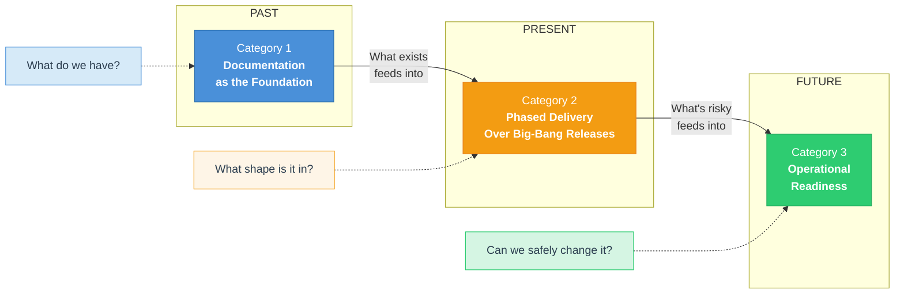

| # | Category | Question | Time | Core Method |
| :-: | :--------- | :--------- | :----- | :------------ |
| 1 | Documentation as the Foundation | What do we have? | Past | Archaeological dig |
| 2 | Phased Delivery Over Big-Bang Releases | What shape is it in? | Present | Risk classification |
| 3 | Operational Readiness | Can we safely change it? | Future | Production readiness review |

### Category 1: Documentation as the Foundation (Past)

Before AI can help with a codebase, the codebase must be documented. This sounds obvious, but 67% of legacy systems lack reliable documentation (per Replay.build research). That is not a minor gap. It is a structural failure that makes every downstream activity harder.

Category 1 treats documentation as an archaeological dig. The goal is to answer "what do we have?" by producing three artifacts: a feature inventory (what the system does), a dependency map (how the pieces connect), and business rule documentation (why the code behaves the way it does). These are prerequisites for AI-assisted development, not nice-to-haves. Without them, an AI agent is navigating blind.

The method is straightforward. DeepGrade's `/deepgrade:codebase-audit` command deploys specialized scanner agents to find features, trace dependencies, and catalog business rules embedded in code. The output is a structured report that serves as the AI's map of the codebase.

### Category 2: Phased Delivery Over Big-Bang Releases (Present)

Once you know what you have, the next question is "what shape is it in?" Category 2 classifies every module by risk level, because not all code is equally dangerous to change.

Risk in DeepGrade is calculated as **business criticality x dependency exposure**, not just lines of code. A 50-line payment processing function with 25 callers (fan-in > 20) is far more dangerous than a 5,000-line reporting utility that runs in isolation. Modules with fan-in above 20 are flagged as danger zones. Modules with fan-out above 40 are flagged as fragile to external changes.

The delivery method follows from the risk classification. Safe modules get modified first, then medium-risk, then high-risk. Each phase has entry criteria (what must be true before starting), exit criteria (what must be true before moving on), and regression testing requirements. This phased approach replaces big-bang releases with incremental, verifiable progress.

Technical debt is classified into three buckets: **CRITICAL** (must fix before proceeding), **MANAGED** (documented and consciously accepted), and **DEFERRED** (low risk, address when convenient). The classification itself is the insight. Most teams treat all debt the same, which means critical debt gets the same attention as trivial debt. Sorting it makes the work plannable.

### Category 3: Operational Readiness (Future)

Category 3 asks the forward-looking question: can we safely change this codebase? Having documentation (Category 1) and risk assessment (Category 2) is necessary but not sufficient. You also need active safety nets to catch problems as they happen.

This category is modeled on [Google SRE's Production Readiness Review](https://sre.google/sre-book/launching/), the industry standard since 2016. Google's key insight is that production systems need explicit readiness criteria, not just "it works on my machine." DeepGrade adapts this framework for AI-assisted development contexts.

Category 3 produces four deliverables:

```text
  ┌──────────────────────────────────────────────────────────────┐
  │                  OPERATIONAL READINESS                       │
  │                  (Category 3 Deliverables)                   │
  ├──────────────────────────────────────────────────────────────┤
  │                                                              │
  │  3A. GUARDRAIL COVERAGE                                      │
  │  ┌──────────────────────────────────────────────────────┐    │
  │  │ Are automated safety nets installed?                  │    │
  │  │ Pre-commit hooks, CI gates, force-push guards,       │    │
  │  │ migration guards, database deploy guards             │    │
  │  └──────────────────────────────────────────────────────┘    │
  │                                                              │
  │  3B. CONTEXT CURRENCY                                        │
  │  ┌──────────────────────────────────────────────────────┐    │
  │  │ Are docs and baselines fresh or stale?                │    │
  │  │ CLAUDE.md age, audit baseline age, spec freshness,   │    │
  │  │ dependency map currency                               │    │
  │  └──────────────────────────────────────────────────────┘    │
  │                                                              │
  │  3C. TEST SAFETY NET                                         │
  │  ┌──────────────────────────────────────────────────────┐    │
  │  │ Is test coverage adequate for high-risk modules?      │    │
  │  │ Characterization tests for legacy code, integration   │    │
  │  │ tests for cross-cutting paths, regression suites      │    │
  │  └──────────────────────────────────────────────────────┘    │
  │                                                              │
  │  3D. CHANGE READINESS SCORE                                  │
  │  ┌──────────────────────────────────────────────────────┐    │
  │  │ Composite rating: GREEN / YELLOW / ORANGE / RED       │    │
  │  │ GREEN  = Safe to change with AI assistance            │    │
  │  │ YELLOW = Proceed with caution, known gaps             │    │
  │  │ ORANGE = Fix gaps before making changes               │    │
  │  │ RED    = Stop. Foundation work required first.         │    │
  │  └──────────────────────────────────────────────────────┘    │
  │                                                              │
  └──────────────────────────────────────────────────────────────┘
```

### Sources for the Three-Category Framework

- [OpenAI: Harness Engineering](https://openai.com/index/harness-engineering/) - Introduces the concept of combining Context Engineering, Architectural Constraints, and Entropy Management into a unified framework for AI-assisted development.
- [Google SRE Book, Chapter 32: Production Readiness Review](https://sre.google/sre-book/launching/) - Defines the industry-standard checklist for determining whether a system is ready for production traffic, including monitoring, incident response, and capacity planning.
- [Cortex: Production Readiness Checklist](https://www.cortex.io/) - Organizes readiness into tiered levels (Bronze, Silver, Gold) across security, reliability, and observability, making it possible to measure incremental progress.
- [GitLab: Production Readiness Review](https://handbook.gitlab.com/handbook/engineering/infrastructure/production/readiness/) - GitLab's internal standard requires "enough documentation, observability, and reliability for production scale" before any service goes live.

The three categories form a dependency chain. You cannot skip ahead. A codebase without documentation (Category 1) cannot have accurate risk classification (Category 2), and a codebase without risk classification cannot have meaningful operational readiness criteria (Category 3). DeepGrade enforces this ordering by requiring earlier categories as inputs to later ones.

---

## 3. The 9-Phase Planning Method

### Design Before Code

The `/deepgrade:plan` command implements a 9-phase workflow that takes any starting input (a vague idea, a folder of vendor docs, a Jira ticket) and produces an audited, executable plan. The method is inspired by two sources:

- [Anthropic: feature-dev plugin](https://github.com/anthropics/claude-code/tree/main/plugins/feature-dev) - Anthropic's own guided workflow uses 7 phases (Discovery through Execute), demonstrating that AI-assisted development benefits from structured phases with explicit transitions rather than open-ended conversation.
- [OpenAI: Harness Engineering](https://openai.com/index/harness-engineering/) - OpenAI's "design-before-code culture" principle argues that the most expensive bugs are the ones introduced before a single line of code is written.

Every phase answers exactly one question. Every phase has a gate that must be passed before proceeding. Some gates require human confirmation. Some are automatic. One is a hard pass/fail. Skipping a phase does not save time. It moves the cost to a later phase where it is more expensive to fix.

### The 9 Phases at a Glance

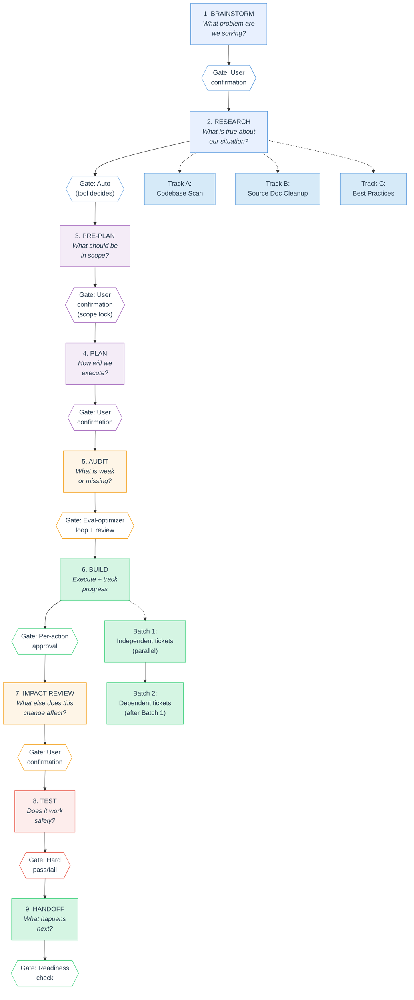

#### Read the 9 Phases in Four Modes

| Mode | Phases | Mental Model | Why It Matters |
| :--- | :----- | :----------- | :------------- |
| **Discover** | 1-3 | Understand the problem, reality, and scope. | Prevents teams from solving the wrong problem. |
| **Design** | 4-5 | Turn scope into an executable, audited plan. | Forces weak assumptions into the open before build starts. |
| **Execute** | 6-7 | Build in batches and then scan for ripple effects. | Keeps progress incremental instead of big-bang. |
| **Prove + Transfer** | 8-9 | Validate the change and package what the next person needs. | Makes completion evidence-based instead of intuitive. |

> Visual cue: the flowchart is detailed on purpose, but the four mode labels are the memory anchors a reader should retain.

### Phase 1: Brainstorm

**Question:** What problem are we solving?
**Gate:** User confirmation

Every plan starts with a problem statement, not a solution. If the input is vague ("we need to fix payments"), the brainstorm phase asks structured questions: What is the problem? Who is affected? Why now? What does success look like? If the input includes source documents, DeepGrade reads them and drafts a problem statement for the user to confirm or adjust.

The output is a `brainstorm.md` file with a problem statement, goals, non-goals, and open questions. Skipping this phase means building a solution to the wrong problem. That is the most expensive mistake in software engineering, and it compounds through every subsequent phase.

### Phase 2: Research

**Question:** What is true about our situation?
**Gate:** Automatic (tool decides "enough")

Research runs three parallel tracks simultaneously:

| Track | What It Does | Tools Used |
| :------ | :------------- | :----------- |
| **Codebase Scan** | Finds all related code in the current project | Grep, Glob, Read |
| **Source Doc Cleanup** | Cleans and structures any provided documents | Read, Write |
| **Best Practices** | Searches for how others solved similar problems | WebSearch, WebFetch |

The three tracks are independent, so DeepGrade runs them as parallel subagents. This is not just a performance optimization. Parallel execution prevents the sequential bias where findings from Track 1 color the interpretation of Track 2.

Research stops when a rubric is met: all open questions from brainstorm are answered (or explicitly deferred), at least one viable implementation path is identified, and top risks have mitigation ideas. The auto-gate prevents both premature closure ("we have enough") and analysis paralysis ("let's research one more thing").

### Phase 3: Pre-Plan

**Question:** What should be in scope?
**Gate:** User confirmation (scope lock)

This phase produces a one-page alignment checkpoint. One page. Not ten. The discipline of compression forces clarity. The checkpoint contains five elements:

1. **Scope:** IN list and OUT list. If it is not on the IN list, it is not in scope. Period.
2. **Approach/Pattern:** Which architectural pattern (strangler fig, feature flag, migration, new build) and why.
3. **Top 3 Risks:** Each with impact level and mitigation strategy.
4. **Constraints:** Timeline, team size, technology limitations.
5. **Dependencies:** Internal, external, hard blockers, soft dependencies.

The user must explicitly confirm this checkpoint. This is the scope lock. Everything after this phase operates within the boundaries set here. If scope needs to change later, the plan loops back to Pre-Plan and re-locks.

### Phase 4: Plan

**Question:** How will we execute?
**Gate:** User confirmation

The plan phase produces the full specification at `docs/specs/{plan-name}.md`, written in three views for three audiences:

- **JIRA-Ready Tickets:** For the team doing the work. Each ticket has a title, acceptance criteria, and is assignable.
- **Leadership Summary:** For stakeholders. Executive summary, timeline table, go/no-go criteria.
- **Working Checklist:** For the person driving it. Step-by-step with verification at each step.

Detail level scales with risk. High-risk phases get exact file paths, function names, grep patterns, and test requirements. Low-risk phases get goals, scope, and success criteria. This is intentional. Over-specifying low-risk work wastes time. Under-specifying high-risk work causes failures.

### Phase 5: Audit

**Question:** What is weak or missing?
**Gate:** Evaluator-optimizer loop + human review

The audit is a stress test. DeepGrade runs four checks against the plan:

1. **8-Dimension Score:** Rates the plan from 1-5 across eight quality dimensions. Thresholds: 32-40 GREEN, 24-31 YELLOW, 16-23 ORANGE, 1-15 RED.
2. **Devil's Advocate:** Challenges every assumption. "If this fails in production, what is the most likely reason?"
3. **Codebase Verification:** Confirms that file paths, function names, and line numbers referenced in the plan actually exist in the codebase.
4. **Gap Verification:** Four structured outputs (Coverage Matrix, Assumption Register, Scenario Matrix, Cross-Cutting Concern Sweep) plus infrastructure verification and 14 Phase 5 lint rules (see [lint-registry.md](docs/planning-techniques/lint-registry.md)). Two additional rules (LINT-11/12) run at Phase 7.

The Phase 5 audit gate uses an evaluator-optimizer loop. If the score is below 32/40 or gaps remain, the system auto-revises the plan spec and re-audits (up to 2 iterations). After the loop, a human review checkpoint prompts for reviewer sign-off before Build (waivable in solo mode). GREEN + gap-checked means "ready to build." YELLOW + gap-checked means "proceed with known gaps." RED means "go back to Phase 3 or 4."

### Phase 6: Build

**Question:** What got built?
**Gate:** Per-action approval for code changes

Build is the execution phase. Before writing any code, DeepGrade analyzes the ticket dependency graph from the plan and batches independent tickets for parallel execution.

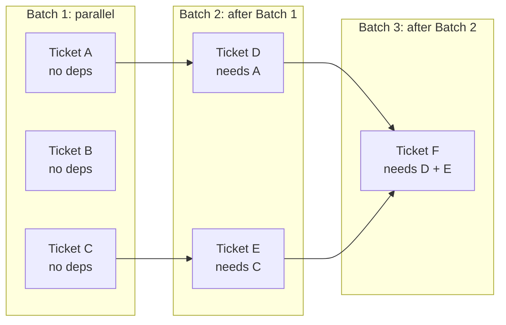

Document actions (updating status, answering questions about the plan) require no approval. Codebase actions (generating code, running tests, creating branches) require explicit per-action approval. This distinction is important: the planning tool should never surprise you by modifying code without asking.

If scope changes are discovered during build, the plan loops back to Pre-Plan. The earlier phases are marked as stale, and the scope lock must be re-confirmed. This backward flow is not a failure. It is the system working as designed.

### Phase 7: Impact Review

**Question:** What else does this change affect?
**Gate:** User confirmation

This is the phase most teams skip, and it is the one that catches the bugs that slip through unit tests. Impact Review checks six dimensions:

| # | Dimension | What It Catches |
| :-: | :---------- | :---------------- |
| 1 | **Integration Edges** | Callers of changed functions that were not updated |
| 2 | **Cross-Layer Effects** | Schema changes that break queries, API changes that break consumers, UI state changes that affect other screens |
| 3 | **Scale/Performance** | Queries inside loops, N+1 patterns, unbounded memory operations |
| 4 | **Transition-State Behavior** | What happens when old and new code run simultaneously during rollout |
| 5 | **Test Delta** | Tests that existed before but were not updated, new behavior without tests |
| 6 | **String Path References** | Stale file paths in mock statements, config files, and documentation after file moves |

Phase 7 is adapted from cross-cutting concern analysis in SRE practices. The insight is that code changes ripple. A function that "just" changes a return type can break callers in five other modules. Impact Review explicitly hunts for these ripple effects by deploying parallel subagents to scan each dimension independently.

DeepGrade runs three parallel subagents: one for Integration and Cross-Layer effects, one for Scale and Transition-State analysis, and one for Test Delta and String Path references. The orchestrator synthesizes findings and flags any HIGH severity issues that should be resolved before testing.

### Phase 8: Test

**Question:** Does it work safely?
**Gate:** Hard pass/fail

Test is one of three phases with hard gates (Phase 5 has the evaluator-optimizer loop, Phase 6 has the assumption verification gate, Phase 8 has the readiness gate). Before proceeding to Handoff, all of these must be true:

- All critical path tests pass (or are explicitly waived with a documented reason)
- No open P0/P1 defects against this plan
- Characterization baseline captured for any refactored code
- Audit score is GREEN or YELLOW with gap-checked = YES
- Rollback plan has been validated

If any condition fails, the plan stays in Test. There is no override. This is deliberate. A test gate that can be bypassed is not a gate, it is a suggestion.

### Phase 9: Handoff

**Question:** What happens next?
**Gate:** Readiness check

Handoff produces context-aware guidance based on the situation. If the plan is ready to ship, it provides a specific deployment sequence with verification steps. If gaps remain, it provides a prioritized list of what to fix. If there is timeline pressure, it separates critical path items from deferrable ones.

The handoff also records decisions made, lessons learned, and what was deferred. This documentation feeds back into Category 1 (Documentation as the Foundation), closing the loop between the planning workflow and the grading framework.

### What Skipping Costs You

Every phase exists because skipping it has a known cost:

| Phase Skipped | Typical Consequence |
| :------------ | :------------------ |
| 1. Brainstorm | Build the wrong thing |
| 2. Research | Rediscover known constraints mid-build |
| 3. Pre-Plan | Scope creep, rework, team misalignment |
| 4. Plan | Ad-hoc execution, missed dependencies |
| 5. Audit | Gaps discovered in production |
| 6. Build | You cannot skip this one |
| 7. Impact Review | Cross-cutting bugs in production |
| 8. Test | Unvalidated changes shipped to users |
| 9. Handoff | Knowledge lost, next team starts from zero |

The cost of a skipped phase increases exponentially with distance from the skip. A problem missed in Brainstorm (Phase 1) that surfaces during Test (Phase 8) costs roughly 100x more to fix than catching it in Phase 1. This is not a DeepGrade-specific observation. It is the well-documented cost-of-change curve applied to AI-assisted development workflows.

---

## 4. The AI Readiness Scan (52 Checks)

### Why 9 Categories, and Why These 9

Most AI readiness advice boils down to "write better docs." That is not wrong, but it is not actionable. DeepGrade replaces that vague guidance with 52 deterministic checks organized into 9 categories, each measuring a specific dimension of how well an AI agent can read, navigate, and safely modify your codebase.

The 9 categories were not chosen arbitrarily. They emerged from synthesizing five independent research frameworks that each approached the same question from a different angle.

- [Matt Pocock: 8 Principles](https://www.aihero.dev/how-to-make-codebases-ai-agents-love~npyke) found that treating AI "like a constantly arriving new starter" reveals exactly which onboarding signals are missing.
- [Derick Chen: 5 Enterprise Code Smells](https://www.buildwithdc.co/posts/your-code-base-isnt-ready-for-ai/) identified five enterprise code smells that block AI effectiveness: poor structure, distributed logic, unexplained acronyms, missing comments, and documentation living far from code.
- [Shaharia Azam: AI Integration Framework](https://shaharia.com/blog/ai-integration-framework/) proposed a three-layer framework combining quality gates, AI-navigable context, and frictionless workflow into a single readiness model.
- [SuperGok: Agent Readiness Framework](https://supergok.com/agent-readiness-framework/) developed an 8-axis, 5-level maturity model that treats agent readiness as a measurable spectrum rather than a binary state.
- [Basti Ortiz: "Coding Agents as First-Class Consideration"](https://dev.to/somedood/coding-agents-as-a-first-class-consideration-in-project-structures-2a6b) demonstrated that the 40% context window rule and vertical slicing directly determine whether an agent succeeds or fails.

When you overlay these five frameworks, the same themes keep surfacing: identity, context, structure, navigation, conventions, verification, memory, efficiency, and data. Those are the 9 categories.

### The 9 Categories at a Glance

```text
 ┌─────────────────────────────────────────────────────────────────────────┐
 │                     AI READINESS SCAN: 9 CATEGORIES                    │
 ├─────────────────────────────────────────────────────────────────────────┤
 │                                                                        │
 │  ┌──────────────┐  ┌──────────────┐  ┌──────────────┐                 │
 │  │ 1. Manifest   │  │ 2. Context   │  │ 3. Structure │                 │
 │  │    Detection  │  │    Files     │  │              │                 │
 │  │    4 checks   │  │   10 checks  │  │   8 checks   │                 │
 │  │  "Who am I?"  │  │ "What do I   │  │ "Can I find  │                 │
 │  │              │  │   know?"     │  │  my way?"    │                 │
 │  └──────────────┘  └──────────────┘  └──────────────┘                 │
 │                                                                        │
 │  ┌──────────────┐  ┌──────────────┐  ┌──────────────┐                 │
 │  │ 4. Entry     │  │ 5. Conven-   │  │ 6. Feedback  │                 │
 │  │    Points    │  │    tions     │  │    Loops     │                 │
 │  │   5 checks   │  │   7 checks   │  │   6 checks   │                 │
 │  │ "Where does  │  │ "What are    │  │ "Can I check │                 │
 │  │  it start?"  │  │  the rules?" │  │  my work?"   │                 │
 │  └──────────────┘  └──────────────┘  └──────────────┘                 │
 │                                                                        │
 │  ┌──────────────┐  ┌──────────────┐  ┌──────────────┐                 │
 │  │ 7. Baseline  │  │ 8. Context   │  │ 9. Database  │                 │
 │  │              │  │    Budget    │  │  (optional)  │                 │
 │  │   4 checks   │  │   8 checks   │  │   8 checks   │                 │
 │  │ "Is there a  │  │ "Am I within │  │ "Can I see   │                 │
 │  │  before?"    │  │  budget?"    │  │  the data?"  │                 │
 │  └──────────────┘  └──────────────┘  └──────────────┘                 │
 │                                                                        │
 └─────────────────────────────────────────────────────────────────────────┘
```

### What Each Category Measures

| # | Category | Checks | What It Measures | Weight (no DB) | Weight (with DB) | Max Pts | Key Source |
| :-: | ---------- | :------: | ------------------ | :--------------: | :----------------: | :-------: | ------------ |
| 1 | **Manifest Detection** | 1.1--1.4 | Can the agent identify the project? Language, framework, dependencies, and purpose. | 15% | 14% | 9 | [Pocock](https://www.aihero.dev/how-to-make-codebases-ai-agents-love~npyke): onboarding signals |
| 2 | **Context Files** | 2.1--2.10 | Does CLAUDE.md exist? Is it well-structured? Does it have commands, conventions, and stack info? | 20% | 18% | 20 | [Chen](https://www.buildwithdc.co/posts/your-code-base-isnt-ready-for-ai/): documentation distance |
| 3 | **Structure** | 3.1--3.8 | Directory naming, co-location, nesting depth, monolith files, module boundaries, token cost per module. | 18% | 17% | 16 | [Ortiz](https://dev.to/somedood/coding-agents-as-a-first-class-consideration-in-project-structures-2a6b): vertical slicing + 40% rule |
| 4 | **Entry Points** | 4.1--4.5 | Can the agent trace where execution begins? Are routes centralized? Are slash commands and agents defined? | 10% | 9% | 11 | [Azam](https://shaharia.com/blog/ai-integration-framework/): frictionless workflow |
| 5 | **Conventions** | 5.1--5.7 | Linter/formatter configs, type safety, pattern consistency, do-not-touch zones, MCP configuration. | 12% | 11% | 13 | [Chen](https://www.buildwithdc.co/posts/your-code-base-isnt-ready-for-ai/): unexplained patterns |
| 6 | **Feedback Loops** | 6.1--6.6 | Tests exist, test runner configured, CI/CD present, pre-commit hooks, Claude Code hooks, test command validation. | 8% | 7% | 11 | [SuperGok](https://supergok.com/agent-readiness-framework/): verification axis |
| 7 | **Baseline** | B.1--B.4 | Machine-readable state files, previous audit results, progress tracking, structured data outputs. | 5% | 5% | 5 | [Azam](https://shaharia.com/blog/ai-integration-framework/): quality gates |
| 8 | **Context Budget** | 8.1--8.8 | Total persistent token overhead, instruction density, rules scoping, progressive disclosure, anti-patterns. | 12% | 11% | 13 | [Ortiz](https://dev.to/somedood/coding-agents-as-a-first-class-consideration-in-project-structures-2a6b): 40% context window rule |
| 9 | **Database** | 9.1--9.8 | Schema-as-code, typed models, migrations, data access layer, MCP connection, seed data, schema docs. | N/A | 8% | 14 | [SuperGok](https://supergok.com/agent-readiness-framework/): data readiness axis |

### Why Context Files Get the Highest Weight

Context Files (Category 2) carries the highest weight at 20% because this is the single category that determines whether the agent even knows what project it is looking at. Without CLAUDE.md, an agent arrives with zero project-specific knowledge. It cannot tell a Next.js marketing site from a Django REST API.

Structure (Category 3) comes second at 18% because even with perfect documentation, an agent that cannot navigate the directory tree will waste its context window searching for things.

Context Budget (Category 8) at 12% reflects a discovery that emerged during development: codebases can have too much AI context. Overloaded CLAUDE.md files and unscoped rules degrade performance just as badly as missing documentation. This category was added in v0.2.0 after observing real projects where bloated context files caused instruction-following failures.

### The Conditional Category

Category 9 (Database) only runs if the codebase actually uses a database. The scanner checks for ORM configs, migration directories, database packages in manifests, connection strings in `.env` files, and SQL files. If none are found, the category returns `not_applicable` and the non-database weight set applies.

This matters because not every project has a database. A CLI tool, a static site generator, or a pure computation library should not be penalized for lacking schema documentation. When the database category is excluded, its 8% weight is redistributed across the remaining categories.

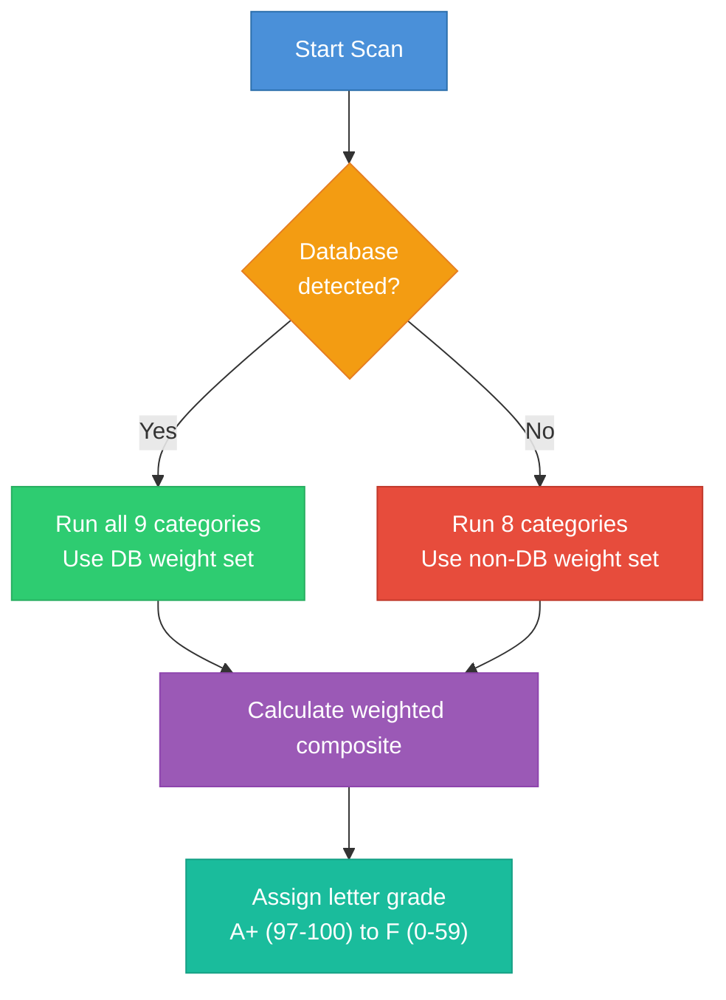

### How the Composite Grade Works

Each category produces a percentage: `points_earned / max_points * 100`. The composite score is a weighted average of those percentages using the appropriate weight set. The grade maps to fixed ranges:

```text
  A+  97-100     B+  87-89     C+  77-79     D+  67-69
  A   93-96      B   83-86     C   73-76     D   63-66
  A-  90-92      B-  80-82     C-  70-72     F   0-62
```

The formula with database:

```text
  final = (manifest_pct * 0.14) + (context_pct * 0.18) + (structure_pct * 0.17)
        + (entry_pct * 0.09) + (convention_pct * 0.11) + (feedback_pct * 0.07)
        + (baseline_pct * 0.05) + (budget_pct * 0.11) + (database_pct * 0.08)
```

The formula without database:

```text
  final = (manifest_pct * 0.15) + (context_pct * 0.20) + (structure_pct * 0.18)
        + (entry_pct * 0.10) + (convention_pct * 0.12) + (feedback_pct * 0.08)
        + (baseline_pct * 0.05) + (budget_pct * 0.12)
```

A codebase needs a B- (80%) or above, plus all hard gates passing, to qualify for the Phase 2 deep audit.

### The Gate System: Hard vs. Soft

Not all checks are equal. Eight of the 52 checks serve as gates, split into two tiers that control access to the Phase 2 codebase audit.

```text
 HARD GATES (4)                           SOFT GATES (4)
 Must pass or Phase 2 is blocked          Score penalty + warning only
 ┌────────────────────────────────┐       ┌────────────────────────────────┐
 │ 1.1  Primary manifest exists   │       │ 2.5  CLAUDE.md exists          │
 │ 2.1  Context file exists       │       │ 2.9  CLAUDE.md has commands    │
 │ 4.1  Entry point identifiable  │       │ 3.6  No monolith files >5000   │
 │ 6.1  Test files exist          │       │ 5.6  Do-not-touch zones marked │
 └────────────────────────────────┘       └────────────────────────────────┘
       │                                         │
       ▼                                         ▼
  FAIL any ──► Phase 2 BLOCKED            FAIL any ──► Phase 2 runs with
  entirely. Fix these first.               MEDIUM confidence on affected
                                           modules. Warnings in report.
```

The hard gates represent absolute minimums. Without a manifest (1.1), the agent cannot detect the technology stack. Without a context file (2.1), the agent lacks any project-specific knowledge. Without an entry point (4.1), the feature scanner has no starting location. Without tests (6.1), risk assessment becomes unreliable because there is no way to verify that analysis conclusions are correct.

Phase 2 eligibility follows three paths:

- **ELIGIBLE:** Score >= 80 AND all 4 hard gates pass.
- **ELIGIBLE WITH WARNINGS:** Score >= 70 AND all hard gates pass, but one or more soft gates fail. Phase 2 runs with MEDIUM confidence on affected modules.
- **NOT ELIGIBLE:** Score < 70 OR any hard gate fails.

### Why Gate 3.6 Is Soft

Gate 3.6 (no monolith files over 5,000 lines) might look like it should be a hard gate. After all, monolith files are a serious structural problem. But making it a hard gate creates a circular dependency.

Here is the problem: monolith files are the exact reason you need the Phase 2 audit. The audit produces the refactoring roadmap, identifying which functions to extract, in what order, with what risk. If the audit is blocked until the monolith is already refactored, you have to refactor without a roadmap. That is backwards.

Instead, modules inside monolith files receive MEDIUM confidence in the Phase 2 report, while modules outside receive HIGH confidence. The roadmap gets built. The refactoring happens with guidance rather than guesswork. After refactoring, the next readiness scan shows gate 3.6 passing, the monolith modules get upgraded to HIGH confidence, and the system moves forward.

### Deterministic Scoring

Every check uses explicit bash commands with fixed thresholds. There is no room for agent interpretation. If Check 3.3 (nesting depth) runs `find` and gets a max depth of 8 and an average of 3.2, the score is determined by comparing against fixed cutoffs: max <= 7 AND avg < 4.0 = 2 points, max <= 10 AND avg < 5.0 = 1 point, else 0 points. The agent does not get to decide whether 8 levels of nesting "feels okay."

This determinism is the difference between a grade you can trust and a grade that changes depending on which model runs the scan. Run it twice, get the same number. The scoring rules are baked into each scanner agent as fixed conditional logic, not as guidelines for interpretation.

---

## 5. Context Engineering

### The Most Important Insight

Here is the single most important insight in this entire methodology: from an AI agent's perspective, anything not in-context does not exist. Your codebase could have pristine architecture, 95% test coverage, and beautifully written docs. None of that matters if it never reaches the agent's context window.

Context engineering is the discipline of controlling what enters the agent's context window, in what order, and at what cost. It matters more than code quality for AI-assisted development because the agent's behavior is determined entirely by what it can see during a given session.

### The Context Window Budget

Claude Code operates within a 200,000-token context window. That sounds enormous until you see how much is already spoken for before you type your first message.

```text
 ┌──────────────────────────────────────────────────────────────┐
 │               200,000 TOKEN CONTEXT WINDOW                   │
 ├──────────────────────────────────────────────────────────────┤
 │                                                              │
 │  ┌────────────────────────────────┐                         │
 │  │ System Prompt (~18,000 tokens) │  <-- Claude Code's own  │
 │  │ Tool definitions, safety rules │      instructions        │
 │  │ ~50 built-in instructions      │                         │
 │  └────────────────────────────────┘                         │
 │                                                              │
 │  ┌────────────────────────────────┐                         │
 │  │ Autocompact Buffer (~33,000)   │  <-- Reserved for       │
 │  │ Conversation summary after     │      memory across       │
 │  │ compaction events              │      compactions          │
 │  └────────────────────────────────┘                         │
 │                                                              │
 │  ┌────────────────────────────────┐                         │
 │  │ CLAUDE.md + Rules + Memory     │  <-- YOUR persistent    │
 │  │ (~2,500 - 10,000 tokens)       │      context. THIS is   │
 │  │                                │      what you control.   │
 │  └────────────────────────────────┘                         │
 │                                                              │
 │  ┌────────────────────────────────────────────────────────┐ │
 │  │                                                        │ │
 │  │            REMAINING: Actual Work                      │ │
 │  │            (~139,000 - 147,000 tokens)                 │ │
 │  │                                                        │ │
 │  │  File reads, code generation, tool calls,              │ │
 │  │  conversation history, grep results...                 │ │
 │  │                                                        │ │
 │  └────────────────────────────────────────────────────────┘ │
 │                                                              │
 └──────────────────────────────────────────────────────────────┘
```

The system prompt consumes roughly 15,000 to 20,000 tokens just to give Claude its core instructions, tool definitions, and safety guardrails. The autocompact buffer reserves about 33,000 tokens so that when the conversation grows too long and gets compacted, a summary of what happened survives into the next segment. These are fixed costs you cannot reduce.

That leaves your persistent context as the variable you control: CLAUDE.md, unscoped rules files, auto-memory (CLAUDE.local.md), MCP server tool descriptions, and skill catalogs. This is where bloat kills performance.

### The Instruction Budget

[Tembo: "How to Write a Great CLAUDE.md"](https://www.tembo.io/blog/how-to-write-a-great-claude-md) surfaced a critical constraint: "Even the best frontier models can only reliably follow around 200 distinct instructions." This finding comes from IFScale research by Distyl AI (2025), which benchmarked frontier models on instruction-following at scale and found reliable compliance in the 150 to 200 instruction range.

Claude Code's system prompt already uses about 50 of those instructions. That leaves 100 to 150 instructions for everything you add: CLAUDE.md, unscoped rules, and auto-memory combined.

[Allahabadi.dev: "7 CLAUDE.md Mistakes"](https://allahabadi.dev/blogs/ai/7-claude-md-mistakes-developers-make/) reports that Boris Cherny, the creator of Claude Code, keeps his own team's CLAUDE.md at approximately 2,500 tokens (about 100 lines). That is not minimalism for its own sake. It is precision engineering for the instruction budget.

DeepGrade's context budget scanner (Checks 8.1-8.8) enforces these thresholds:

```text
  Target:  CLAUDE.md under 60 instructions
  Target:  Total persistent instructions under 80
  Warning: Over 120 total instructions (budget approaching ceiling)
  Danger:  Over 150 total instructions (competing with system prompt)
```

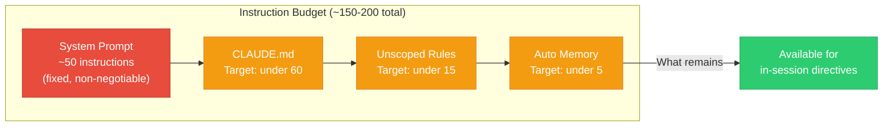

### Nine Anti-Patterns That Waste Context

DeepGrade's context budget scanner (Check 8.8) detects 9 specific anti-patterns that waste persistent context tokens. Each one has a direct mechanism of harm.

| ID | Anti-Pattern | What It Looks Like | Why It Hurts |
| ---- | ------------- | ------------------- | ------------- |
| AP1 | Embedded code blocks over 10 lines | Full function implementations inside CLAUDE.md | Burns tokens on code that belongs in source files. The agent reads source files anyway when it needs them. |
| AP2 | README content duplicated in CLAUDE.md | Copy-pasted project descriptions, setup instructions | Same information loaded twice. README is not auto-loaded, so if it is also in CLAUDE.md, you are paying double for one copy the agent never sees independently. |
| AP3 | Full file contents pasted into CLAUDE.md | Entire config files or type definitions embedded as instructions | Massive token waste. Point to the file instead. Claude can read it on demand with the Read tool. |
| AP4 | Duplicate instructions across CLAUDE.md and rules | Same "ALWAYS use X" appearing in both locations | Redundant instructions compete for attention and create ambiguity about which copy is authoritative. |
| AP5 | Orphan rules (scope patterns matching no files) | A rule scoped to `src/api/**/*.ts` when no such directory exists | Dead rules still consume context when scope pattern evaluation fails open. They add noise without value. |
| AP6 | README used as CLAUDE.md | Imperative AI instructions (ALWAYS, NEVER, MUST) living in README.md with no CLAUDE.md present | [HumanLayer: "Writing a Good CLAUDE.md"](https://www.humanlayer.dev/blog/writing-a-good-claude-md) documents that README.md is NOT auto-loaded by Claude Code. Those instructions are invisible to the agent. |
| AP7 | Linter-enforceable rules in CLAUDE.md | "Always use 2-space indentation," "Use single quotes," "Add trailing commas" | [HumanLayer](https://www.humanlayer.dev/blog/writing-a-good-claude-md) puts it plainly: "Never send an LLM to do a linter's job." Linter configs enforce deterministically. CLAUDE.md instructions enforce probabilistically. The linter wins every time. |
| AP8 | Expensive @imports | `@docs/full-api-reference.md` loading a 5,000-line file at session start | @imports load at launch, not lazily. Every imported file adds to startup context cost regardless of whether the session needs that content. |
| AP9 | Unscoped domain rules | A rule about `.tsx` component patterns without `globs:` frontmatter | Unscoped rules load every session. A rule about React components loads when you are editing Python scripts, wasting budget on irrelevant instructions. |

### Progressive Disclosure: The Solution

The fix for context bloat is not deleting instructions. It is restructuring them using progressive disclosure: CLAUDE.md stays small and points to detailed docs that Claude reads only when working in specific areas. Scoped rules (via `paths:` or `globs:` frontmatter in Claude Code) only load when Claude touches matching files.

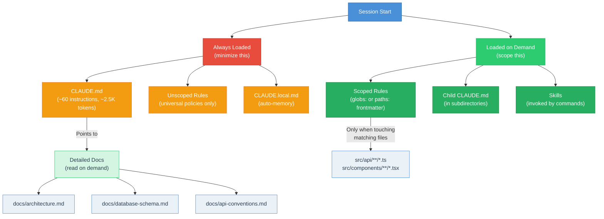

Child CLAUDE.md files in subdirectories are lazy-loaded, meaning Claude only reads them when it reads or writes files in that subdirectory. They act like on-demand skills for subdirectory-specific conventions. For monorepos, child CLAUDE.md files are the right tool. For single-package projects, scoped rules files in `.claude/rules/` with `paths:` frontmatter are usually the better fit.

### The Three-Tier Context Model

[Steven Poitras: Three-Tier Context System](https://agenticthinking.ai/blog/three-tier-context/) proposed a layered context architecture that maps well to how DeepGrade thinks about context levels. [OpenAI: Harness Engineering](https://openai.com/index/harness-engineering/) makes a similar distinction between static context (docs, AGENTS.md) and dynamic context (CI status, directory mapping), showing that the tier model is converging across the industry.

DeepGrade synthesizes these into a practical model:

```text
 TIER 1: ALWAYS LOADED (minimize this)
 ├── CLAUDE.md (core instructions, under 60 directives)
 ├── Unscoped .claude/rules/ files (universal policies)
 └── CLAUDE.local.md (auto-memory from previous sessions)

 TIER 2: CONDITIONALLY LOADED (scope this)
 ├── Scoped rules (globs: / paths: frontmatter)
 ├── Child CLAUDE.md (subdirectory-specific, lazy-loaded)
 └── Skill content (loaded when commands invoke them)

 TIER 3: ON-DEMAND (point to this)
 ├── docs/architecture.md (Claude reads when relevant)
 ├── docs/schema.md (Claude reads when touching database code)
 ├── docs/api-conventions.md (Claude reads when working in API layer)
 └── Previous audit reports (Claude reads for historical context)
```

The principle is simple: the less you load by default, the more room the agent has for the actual work. A CLAUDE.md that tries to be comprehensive is a CLAUDE.md that competes with the code Claude is trying to read.

### Why Bloat Kills Performance

The mechanism is not mysterious. Every token of persistent context consumes attention that could go toward understanding the code the developer actually asked about. When CLAUDE.md is 500 lines of instructions, the agent is processing 500 lines of "how to behave" before it even looks at the file you asked it to modify.

[HumanLayer: "Writing a Good CLAUDE.md"](https://www.humanlayer.dev/blog/writing-a-good-claude-md) points out that Claude Code wraps CLAUDE.md content with a caveat that it "may or may not be relevant" to the current task. The agent is already treating your persistent context as potentially disposable. Write it accordingly: high-signal, low-volume, and structured so the most important instructions come first.

The worst case is not too little context. It is too much irrelevant context. A lean CLAUDE.md with 40 precise instructions outperforms a bloated one with 200 instructions that the agent partially ignores because it cannot reliably track them all. DeepGrade's Context Budget category (Category 8) exists specifically to catch this failure mode before it degrades your AI-assisted development experience.

---

## 6. Defense-in-Depth Safety

### Why One Guard Is Not Enough

A single safety mechanism has a single failure mode. If your only protection against accidental data loss is a pre-commit hook, and that hook has a bug, your protection is zero. Defense-in-depth solves this by stacking multiple independent layers so that a failure in any one layer is caught by the next.

This is not a new idea. It comes from military strategy and was adopted by information security decades ago. DeepGrade applies the same principle to AI-assisted development: an AI agent should not be able to do something destructive even if one safety mechanism fails.

### The Three Layers

DeepGrade implements safety in three concentric layers. Each layer operates independently. Each layer catches a different class of mistake. The outermost layer is fully automatic. The innermost layer requires a human.

```text
 ┌─────────────────────────────────────────────────────────────────────┐
 │                                                                     │
 │  LAYER 1: PLUGIN HOOKS (automatic, deterministic)                  │
 │  ┌───────────────────────────────────────────────────────────────┐  │
 │  │                                                               │  │
 │  │  LAYER 2: CI/CD PIPELINE (automatic, environment-gated)      │  │
 │  │  ┌─────────────────────────────────────────────────────────┐  │  │
 │  │  │                                                         │  │  │
 │  │  │  LAYER 3: PLAN WORKFLOW (human-in-the-loop)            │  │  │
 │  │  │                                                         │  │  │
 │  │  │  Phase 5: Audit + evaluator-optimizer loop + review     │  │  │
 │  │  │  Phase 7: Impact Review checks cross-cutting concerns  │  │  │
 │  │  │  Phase 6: Assumption gate + Phase 8: Test gate         │  │  │
 │  │  │                                                         │  │  │
 │  │  └─────────────────────────────────────────────────────────┘  │  │
 │  │                                                               │  │
 │  │  PR validates against dev branch                              │  │
 │  │  Manual gate for production deploy                            │  │
 │  │  Advisory mode for first 2 weeks, then blocking               │  │
 │  │                                                               │  │
 │  └───────────────────────────────────────────────────────────────┘  │
 │                                                                     │
 │  Force push guard    Migration guard    DB deploy guard            │
 │  Hard reset guard    Change tracker     Test/build tracker         │
 │  Session summary                                                    │
 │                                                                     │
 └─────────────────────────────────────────────────────────────────────┘
```

The beauty of this arrangement is redundancy. An AI agent that somehow bypasses the plugin hooks (Layer 1) still hits the CI pipeline (Layer 2). A change that clears CI still goes through human review in the plan workflow (Layer 3). No single failure is catastrophic.

### Layer 1: Plugin Hooks

Plugin hooks are the first line of defense. They fire automatically at specific points in the Claude Code lifecycle and require zero human attention. They are defined inline in [`plugin.json`](.claude-plugin/plugin.json) and execute as bash commands.

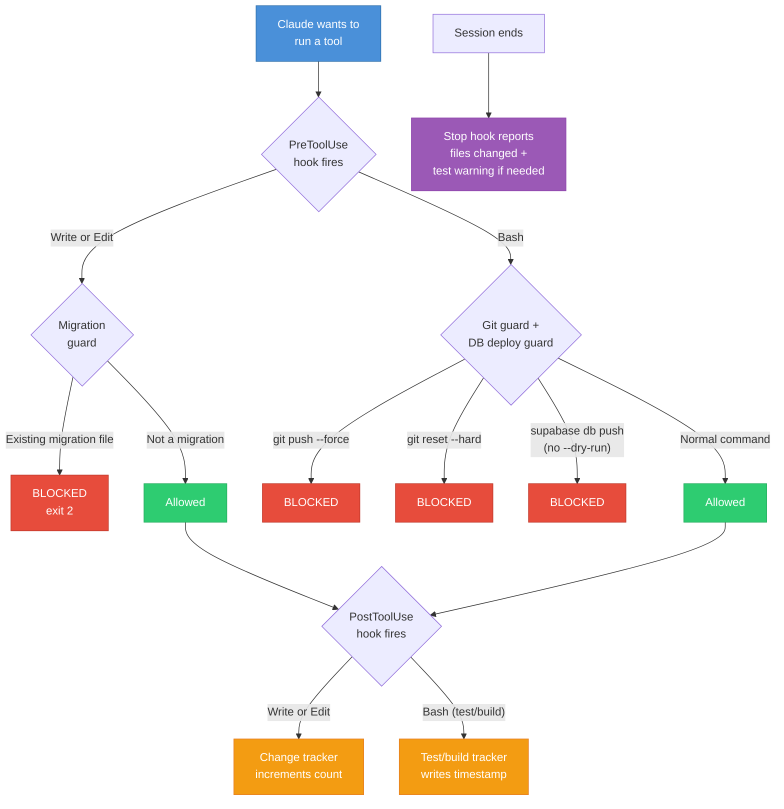

Seven hooks run as part of Layer 1:

**Force push guard** ([`plugin.json` PreToolUse:Bash](.claude-plugin/plugin.json)). Blocks `git push --force`. Force pushes rewrite shared history and can destroy other people's work. Use `--force-with-lease` if you truly need it (the guard does not block that).

**Hard reset guard** ([`plugin.json` PreToolUse:Bash](.claude-plugin/plugin.json)). Blocks `git reset --hard`. A hard reset permanently discards all uncommitted changes. If Claude has been editing files for 30 minutes and you hard-reset, all that work vanishes. The guard forces you to think twice.

**Migration guard** ([`plugin.json` PreToolUse:Write|Edit](.claude-plugin/plugin.json)). Blocks edits to existing migration files. Modifying an applied migration can corrupt databases. The correct action is always to create a new migration. New migration files are allowed; only edits to existing ones trigger the guard.

**DB deploy guard** ([`plugin.json` PreToolUse:Bash](.claude-plugin/plugin.json)). Blocks direct database deploy commands (`supabase db push`, `prisma migrate deploy`, `dotnet ef database update`, `flyway migrate`, `rails db:migrate`) unless the command includes `--dry-run`, `--local`, `RAILS_ENV=test`, or `RAILS_ENV=development`. As [Supabase: Managing Environments](https://supabase.com/docs/deployment/managing-environments) puts it: "Use a CI/CD pipeline rather than deploying from your local machine."

**Change tracker** ([`plugin.json` PostToolUse:Write|Edit](.claude-plugin/plugin.json)). Counts file changes per session by incrementing a counter in `/tmp/dg-baseline-{session}`. When the count crosses a configurable threshold (default: 15), it suggests running a delta scan. This is a nudge, not a blocker.

**Test/build tracker** ([`plugin.json` PostToolUse:Bash](.claude-plugin/plugin.json)). Silently records timestamps when test or build commands run. Recognizes test and build commands across Node (jest, vitest, npm test), Python (pytest), .NET (dotnet test/build), Rust (cargo test/build/check), and Go (go test/vet). The Stop hook and Git Guard read these timestamps to know whether tests ran.

**Session summary** ([`plugin.json` Stop](.claude-plugin/plugin.json)). Reports the total file change count when a session ends. If files were changed but no tests ran (and the project has tests), it warns you. This is always informational; Stop hooks must use exit 0 to avoid infinite re-trigger loops.

### The Fail-Closed Principle

Guards (migration, force push, hard reset, DB deploy) are fail-closed: if the hook cannot parse its input, it blocks the action. It is better to incorrectly block a safe action than to incorrectly allow a dangerous one.

Trackers (change counter, test/build tracker) are fail-open: if the hook cannot parse its input, it silently does nothing. Missing a count is harmless. Blocking legitimate work because a counter failed is not.

```text
  ┌─────────────────────────────────────────────────┐
  │              FAIL-CLOSED vs FAIL-OPEN            │
  ├──────────────────────┬──────────────────────────┤
  │    GUARDS            │    TRACKERS              │
  │    (fail-closed)     │    (fail-open)           │
  ├──────────────────────┼──────────────────────────┤
  │ Force push guard     │ Change counter           │
  │ Hard reset guard     │ Test tracker             │
  │ Migration guard      │ Build tracker            │
  │ DB deploy guard      │ Session summary          │
  ├──────────────────────┼──────────────────────────┤
  │ If in doubt: BLOCK   │ If in doubt: ALLOW       │
  │ exit 2               │ exit 0                   │
  │ Protects data        │ Protects workflow         │
  └──────────────────────┴──────────────────────────┘
```

### Layer 2: CI/CD Pipeline

Layer 2 catches problems at the pull request level, after code leaves the developer's machine. The recommended setup validates PRs against a dev branch, with a manual gate for production deploys.

For teams adopting DeepGrade on an existing codebase, the CI pipeline runs in advisory mode for the first two weeks: it reports findings but does not block merges. After two weeks, it switches to blocking mode. This ramp-up period prevents the "new tool blocks everything on Day 1" frustration that kills adoption.

The pipeline is generated by [`/deepgrade:codebase-gates`](commands/codebase-gates.md), which produces GitHub Actions workflows, pre-commit configs, and supporting scripts based on your actual audit findings. It does not generate a generic template. It generates gates specific to what your scan discovered.

### Layer 3: Plan Workflow

Layer 3 is where a human stays in the loop. The [`/deepgrade:plan`](commands/plan.md) command's 9-phase workflow includes three safety-critical phases:

**Phase 5 (Audit)** scores the plan across 8 quality dimensions with rubric-calibrated scoring (1-5 per dimension, reasoning required before each score). Thresholds: 32-40 GREEN, 24-31 YELLOW, 16-23 ORANGE, 1-15 RED. The audit runs 14 Phase 5 lint rules (LINT-11/12 run at Phase 7), 4 gap verification matrices (coverage, assumptions, scenarios, cross-cutting), infrastructure verification (LINT-15/16), and a devil's advocate challenge. If the score is below 32 or gaps remain, an evaluator-optimizer loop auto-revises and re-audits (up to 2 iterations). A human review checkpoint follows before Build entry.

**Phase 7 (Impact Review)** checks six cross-cutting dimensions: integration edges, cross-layer effects, scale/performance, transition-state behavior, test delta, and string path references. Three parallel subagents scan these dimensions independently. This is the phase that catches the bugs unit tests miss: callers that were not updated, queries inside loops, stale file paths in mock statements.

**Phase 6 (Build)** has a hard assumption verification gate (LINT-08). No HIGH-impact assumption can be unverified unless explicitly waived with documented risk acceptance. This prevents building on unverified foundations.

**Phase 8 (Test)** has a hard readiness gate. All critical path tests must pass, no open P0/P1 defects, characterization baselines captured for refactored code, audit score at GREEN or YELLOW with gap-checked = YES, and rollback plan validated. If any condition fails, the plan stays in Test. There is no override.

### The Zero-Dependency Principle

Every hook runs using tools built into Claude Code (Read, Write, Grep, Glob, Bash) plus standard POSIX utilities (`grep`, `sed`, `stat`, `date`, `wc`). The only optional dependency is `jq` for JSON parsing, and every hook that uses `jq` has a `grep`+`sed` fallback path.

```text
  ┌──────────────────────────────────┐
  │ Hook receives JSON from stdin    │
  └──────────────┬───────────────────┘
                 │
         ┌───────▼────────┐
         │  Is jq          │
         │  installed?     │
         └───┬─────────┬───┘
             │ YES     │ NO
             v         v
  ┌──────────────┐  ┌─────────────────┐
  │ Parse with   │  │ Parse with      │
  │ jq -r       │  │ grep + sed      │
  │ ".field"     │  │ pattern match   │
  └──────┬───────┘  └────────┬────────┘
         │                   │
         └───────┬───────────┘
                 │
         ┌───────▼────────┐
         │ Execute guard   │
         │ or tracker      │
         │ logic           │
         └────────────────┘
```

On session start, the plugin checks for `jq` and warns if it is not found: "[DeepGrade] WARNING: jq not installed. Safety hooks will use fallback parsing. Install jq for best reliability." The guards still work without `jq`. They just use simpler pattern matching that handles the flat JSON structures hooks actually receive.

This design is intentional. Requiring external tools creates installation friction and platform-specific failure modes. A security guard that fails to install is worse than no guard at all because it creates a false sense of safety.

On Windows, where Claude Code runs in Git Bash, `jq` installed via `winget` lands in `$LOCALAPPDATA/Microsoft/WinGet/Links/`, a path Git Bash does not include by default. Every hook starts with `export PATH="$PATH:$LOCALAPPDATA/Microsoft/WinGet/Links:/usr/local/bin"` to ensure `jq` is discoverable regardless of installation method.

### Security Guards Must Never Fail-Open

This principle deserves its own heading because it is the one design decision that cannot be compromised. The migration guard, force push guard, hard reset guard, and DB deploy guard all use exit code 2 (block) as their default path. If parsing fails, if the input is garbled, if the session ID is missing, the guard blocks.

[Shaharia Azam: AI Integration Framework](https://shaharia.com/blog/ai-integration-framework/) calls this the "zero-trust mindset": treat every AI contribution as if it came from a brand-new junior developer. You would not give a junior developer unsupervised force-push access. You should not give it to an AI agent either.

[NxCode: Harness Engineering Guide](https://www.nxcode.io/resources/news/harness-engineering-complete-guide-ai-agent-codex-2026) crystallizes it further: "The model is commodity. The harness is moat." The AI model will be replaced. The safety harness around it is the durable competitive advantage. A plugin without guardrails is a liability. A plugin with layered, fail-closed, zero-dependency guardrails is infrastructure.

---

## 7. The Plan Audit Scoring System

### Why Plans Need a Grade Too

If you have ever watched a project go sideways, you know the problem usually was not the code. It was the plan. Or more precisely, the holes in the plan that nobody noticed until they became production incidents.

DeepGrade's plan audit applies the same grading philosophy from Section 1 to technical plans, migration specs, and refactoring proposals. Instead of a binary "looks good" or "needs work," you get a numeric score across 8 dimensions, structured gap detection, and evidence-backed findings. The methodology is implemented in the [plan-auditor agent](agents/plan-auditor.md).

### The 8-Dimension Scorecard

Each dimension is scored 1 to 5, producing a total out of 40. The dimensions are ordered by when they matter in a plan's lifecycle: WHY first, then HOW, then WHAT-IF.

```text
  THE 8 DIMENSIONS OF PLAN QUALITY

  ┌────────────────────────────────────────────────────────────────────┐
  │                                                                    │
  │  WHY are we doing this?                                            │
  │  ┌──────────────────────────────────────────────────────────┐      │
  │  │  1. Problem Definition         /5   Is the WHY clear?   │      │
  │  └──────────────────────────────────────────────────────────┘      │
  │                                                                    │
  │  HOW will we do it?                                                │
  │  ┌──────────────────────────────────────────────────────────┐      │
  │  │  2. Architecture & Design      /5   Is the HOW sound?   │      │
  │  │  3. Phasing & Sequencing       /5   Is the ORDER right? │      │
  │  └──────────────────────────────────────────────────────────┘      │
  │                                                                    │
  │  WHAT IF something goes wrong?                                     │
  │  ┌──────────────────────────────────────────────────────────┐      │
  │  │  4. Risk Assessment            /5   What could go WRONG? │      │
  │  │  5. Rollback & Safety          /5   Can we UNDO this?   │      │
  │  └──────────────────────────────────────────────────────────┘      │
  │                                                                    │
  │  WHO, WHEN, and HOW do we prove it?                                │
  │  ┌──────────────────────────────────────────────────────────┐      │
  │  │  6. Timeline & Effort          /5   How LONG and MUCH?  │      │
  │  │  7. Testing & Validation       /5   How do we PROVE it? │      │
  │  │  8. Team & Resources           /5   WHO does this?      │      │
  │  └──────────────────────────────────────────────────────────┘      │
  │                                                                    │
  │  TOTAL                           /40                               │
  └────────────────────────────────────────────────────────────────────┘
```

| Dimension | Points | What It Measures | A "1" Looks Like | A "5" Looks Like |
| :---------- | :------: | :----------------- | :----------------- | :----------------- |
| 1. Problem Definition | /5 | Is the WHY clear? Problem stated, business impact quantified, success criteria defined | "We should refactor payments" | Problem quantified, current state documented with evidence, measurable success criteria |
| 2. Architecture & Design | /5 | Is the HOW sound? Architecture diagrammed, tech choices justified, interfaces defined | Vague hand-waving about "new service" | Component diagram, interface contracts, existing codebase patterns followed |
| 3. Phasing & Sequencing | /5 | Is the ORDER right? Phases go low-to-high risk, each delivers value independently | All-or-nothing single phase | Low-risk phases first, each phase delivers value, stop-after-any-phase option |
| 4. Risk Assessment | /5 | What could go WRONG? Risks with likelihood/impact, mitigations defined | "There are some risks" | Top risks with likelihood/impact matrix, contingency plans, highest-risk phase called out |
| 5. Rollback & Safety | /5 | Can we UNDO this? Rollback per phase, feature flags, blast radius documented | No rollback mentioned | Per-phase rollback, feature flag, shadow mode, blast radius quantified |
| 6. Timeline & Effort | /5 | How LONG and how MUCH? Evidence-based estimates, critical path, 20-30% buffer | "Should take a few weeks" | Per-phase estimates with evidence basis, critical path identified, buffer included |
| 7. Testing & Validation | /5 | How do we PROVE it works? Test strategy per phase, characterization tests, acceptance criteria | "We will test it" | Test strategy per phase, characterization tests before refactoring, acceptance criteria per deliverable |
| 8. Team & Resources | /5 | WHO does this? Team identified, skills documented, key person risk addressed | No team mentioned | Team named, skills documented, key person risk mitigated, single accountable owner |

### Score Thresholds

The 40-point scale maps to four zones. Think of them like traffic signals for plan readiness.

```text
  PLAN AUDIT SCORE RANGES

   0          8         16         24         32        40
   ├──────────┼──────────┼──────────┼──────────┼─────────┤
   │   RED    :  ORANGE  :  YELLOW  :         GREEN      │
   │  1 - 15  : 16 - 23  : 24 - 31  :       32 - 40     │
   │          :          :          :                     │
   │  Rework  :   Fix    : Usable   :  Ready to execute  │
   │  the     :   gaps   : with     :  Solid plan.       │
   │  plan.   :  before  : known    :  Ship it.          │
   │          : building.: gaps.    :                     │
   └──────────┴──────────┴──────────┴─────────────────────┘
```

A plan that scores RED is not a bad plan written by a bad engineer. It is usually a plan that was written in a rush and skipped the "boring" parts: rollback strategy, timeline evidence, risk mitigation. The audit tells you exactly which parts are missing so you can add them, not start over.

### The Evidence Requirement

Every finding from the plan audit must carry a confidence tier. This prevents the auditor from generating plausible-sounding gaps that do not actually exist in the plan. The confidence system works the same way as the [codebase audit confidence tiers](commands/codebase-audit.md).

| Tier | Meaning | Example |
| :----- | :-------- | :-------- |
| **HIGH** | Direct quote or reference from plan text or codebase | "Section 3.2 states rollback via feature flag" |
| **MEDIUM** | Indirect evidence (pattern match, naming convention) | "Plan mentions 'incremental rollout' but no specific mechanism" |
| **LOW** | Agent judgment without direct evidence | "No timeline section found [VERIFY WITH AUTHOR]" |

Unverified findings (no evidence at all) are excluded from scoring entirely. They appear in a separate section tagged `[UNVERIFIED]`. This prevents the audit from inflating its gap count with speculative concerns.

### The 4 Structured Gap Checks

Dimension scoring catches qualitative gaps ("the risk section is thin"). But a plan can score 35/40 and still have structural holes that the dimension model misses. That is why the audit runs 4 additional structured checks, implemented by the Gap Verifier subagent in the [plan-auditor](agents/plan-auditor.md).

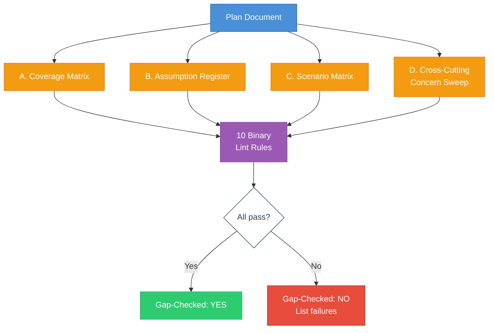

**A. Coverage Matrix** traces every goal, risk, dependency, and non-goal to its implementation in the plan. If a goal from the brainstorm phase has no corresponding ticket or phase, the matrix exposes it. If a risk has no mitigation, same thing.

**B. Assumption Register** catalogs every assumption the plan makes, then asks two questions: what happens if this assumption is false, and how will we verify it before we find out the hard way? Unverified HIGH-impact assumptions are treated as gaps.

**C. Scenario Matrix** checks 8 mandatory scenarios against the plan:

| # | Scenario | What It Catches |
| :-: | :--------- | :---------------- |
| 1 | Happy path | Does the plan describe the normal flow? |
| 2 | Failure path | What happens when things break? |
| 3 | Partial rollout (mixed state) | Old and new code running simultaneously |
| 4 | Backward compatibility | Will existing clients break? |
| 5 | Scale/volume edge | What happens at 10x traffic? |
| 6 | Auth/permission edge | What if the user lacks permissions? |
| 7 | Config/environment difference | Does it work in staging AND production? |
| 8 | Rollback path | Can we actually undo each phase? |

**D. Cross-Cutting Concern Sweep** checks 12 concerns that tend to fall through the cracks because they span multiple domains: API contract, UI behavior, auth/authz, config, CORS/network, data model/query limits, pagination, caching, observability, migration/backward compat, rollout/rollback, and tests.

### The 15 Lint Rules

On top of the 4 matrices, 15 binary pass/fail rules run as automated checks (13 in Phase 5 Audit, 2 in Phase 7 Impact Review). These are the plan equivalent of a linter. Either the rule passes or it does not. See [lint-registry.md](docs/planning-techniques/lint-registry.md) for the canonical registry.

| Rule | Description | Phase |
| :----- | :------------ | :---- |
| LINT-01 | Every goal has a mapped ticket | 5 |
| LINT-02 | Every HIGH risk has a mitigation | 5 |
| LINT-03 | Every deployment has a rollback | 5 |
| LINT-04 | Every external dependency has an owner | 5 |
| LINT-05 | Every new endpoint has a contract/test | 5 |
| LINT-06 | Backward compat has a mixed-state scenario | 5 |
| LINT-07 | Every new behavior has a test delta | 5 |
| LINT-08 | No unverified HIGH-impact assumptions | 5 (hard gate) |
| LINT-09 | No unaddressed cross-cutting concern | 5 |
| LINT-10 | Every phase has go/no-go criteria | 5 |
| LINT-11 | Every code change maps to a plan ticket | 7 (Full only) |
| LINT-12 | Every plan ticket has implementation or is deferred | 7 (Full only) |
| LINT-13 | Approach has options analysis with min 2 alternatives | 5 |
| LINT-15 | All "Tested" claims have verified test infrastructure | 5 |
| LINT-16 | All "Monitored" claims have verified monitoring infra | 5 |

A plan is "gap-checked" only when all applicable lint rules pass (13 in Lite mode, 15 in Full mode), the Coverage Matrix has zero gaps, no unverified HIGH-impact assumptions remain, the Scenario Matrix has zero gaps, the Cross-Cutting Sweep has zero gaps, and infrastructure verification has zero INFRA-GAPs. That is a high bar. Most first-draft plans fail it. That is the point. The evaluator-optimizer loop auto-revises to close gaps before presenting results.

### The 5 Parallel Subagents

The plan audit does not run as a single agent reviewing all 8 dimensions. A single agent reviewing everything gravitates toward the first type of issue it finds (anchoring bias). Instead, the [plan-auditor](agents/plan-auditor.md) deploys 5 specialist subagents in parallel.

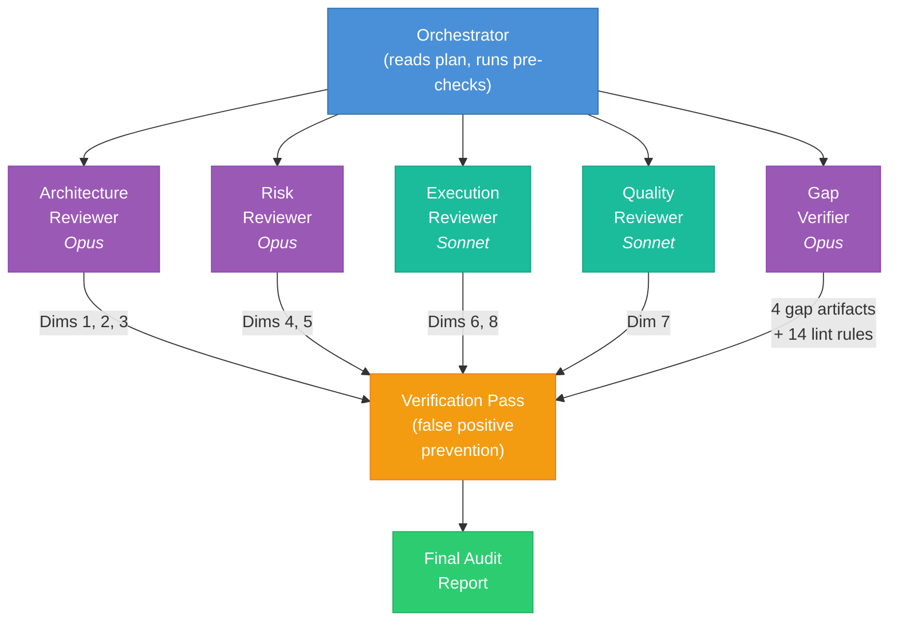

| Subagent | Model | Dimensions | Focus |
| :--------- | :------ | :----------- | :------ |
| Architecture Reviewer | Opus | 1, 2, 3 | Is the design sound? Does it follow existing patterns? |
| Risk Reviewer | Opus | 4, 5 | What could go wrong? Can we undo it? |
| Execution Reviewer | Sonnet | 6, 8 | Is the timeline realistic? Who does the work? |
| Quality Reviewer | Sonnet | 7 | How do we prove this works? |
| Gap Verifier | Opus | None (produces artifacts) | Structural gap detection via 4 matrices + lint |

Architecture and Risk use Opus because those dimensions require deep reasoning about tradeoffs and failure scenarios. Execution and Quality use Sonnet because those are more mechanical assessments (does a timeline exist? are tests mentioned?). This balances quality with cost.

The Gap Verifier is separate from the dimension scorers because structural gap detection (traceability, scenarios, assumptions) uses a fundamentally different methodology than dimension scoring. A plan can score 35/40 GREEN on dimensions but still have 5 gaps in the Coverage Matrix.

### The Verification Pass

After all 5 subagents complete, the orchestrator runs a verification pass to prevent false positives. The process is straightforward: for each candidate gap, re-read the entire plan searching for related keywords. The plan author may have addressed a concern in a section that the specialist did not focus on.

If the gap is found elsewhere, it gets dropped with a note: "Addressed in [section]." If it is genuinely absent, it is confirmed with a confidence tier. The audit report includes verification statistics: "X candidate gaps, Y confirmed, Z dropped (W% false positive prevention rate)."

The verification pass also cross-references between specialists. If the Risk Reviewer found a concern but the Architecture Reviewer scored that dimension 5/5, the contradiction gets investigated. These cross-checks catch the edge cases that individual specialists miss.

### Plan Audit Sources

- [DORA State of DevOps Report](https://dora.dev/) - The four key metrics (deployment frequency, lead time, change failure rate, recovery time) inform what a "production-ready" plan looks like. Plans that address all four metrics score higher on dimensions 4-7.
- [OpenAI: Harness Engineering](https://openai.com/index/harness-engineering/) - The principle that architectural constraints should be enforced mechanically, not by suggestion. The 15 lint rules implement this principle for plans.

---

## 8. LLM Self-Audit (Epistemic Transparency)

### Why AI Auditors Must Audit Themselves

LLM-generated analysis has specific failure modes that human analysis does not. A human auditor who is unsure says "I think" or "I'm not sure." An LLM produces the same confident prose whether it grep-confirmed a file count or hallucinated a pattern from a directory name. The confidence signal is flat. This creates a dangerous asymmetry: the most dangerous findings (high-confidence hallucinations) are the hardest to distinguish from the most reliable findings (tool-verified facts).

DeepGrade's self-audit framework addresses this by requiring every finding to carry an explicit evidence basis that communicates *how* the claim was derived, not just *what* the claim says. The framework is implemented in the [self-audit-knowledge skill](skills/self-audit-knowledge/SKILL.md) and integrated into all Phase 2 scanner agents, the Phase 3 synthesis, and the report generator.

### The Three Verification Tiers

Every finding in a DeepGrade audit carries a verification tier that classifies the evidence type behind the claim.

```text
  CLAIM VERIFICATION TIERS

  ┌─────────────────────────────────────────────────────────────────────┐
  │                                                                     │
  │  TIER A (Tool-Verified)                                            │
  │  ┌───────────────────────────────────────────────────────────────┐  │
  │  │  Claims confirmed by deterministic tool output.              │  │
  │  │  Glob matches, grep results, wc -l counts, manifest parsing. │  │
  │  │  Near-zero hallucination risk.                               │  │
  │  │  Always HIGH confidence unless truncated.                    │  │
  │  └───────────────────────────────────────────────────────────────┘  │
  │                                                                     │
  │  TIER B (Code-Reading)                                             │
  │  ┌───────────────────────────────────────────────────────────────┐  │
  │  │  Claims about runtime behavior, control flow, side effects   │  │
  │  │  derived from reading source files via the Read tool.        │  │
  │  │  Moderate hallucination risk. Confidence depends on          │  │
  │  │  full-file vs. partial read.                                 │  │
  │  └───────────────────────────────────────────────────────────────┘  │
  │                                                                     │
  │  TIER C (Pattern Inference)                                        │
  │  ┌───────────────────────────────────────────────────────────────┐  │
  │  │  Claims assembled from naming conventions, directory          │  │
  │  │  structure, file adjacency, or LLM reasoning.                │  │
  │  │  Highest hallucination risk.                                 │  │
  │  │  Always MEDIUM or LOW confidence.                            │  │
  │  └───────────────────────────────────────────────────────────────┘  │
  │                                                                     │
  └─────────────────────────────────────────────────────────────────────┘
```

The tier is orthogonal to the confidence level. Confidence measures certainty. The tier measures evidence type. A finding can be HIGH confidence and Tier A (a grep confirmed 14 payment files exist) or HIGH confidence and Tier C (the agent inferred a pattern but is quite sure about it). The second combination — HIGH confidence + Tier C — is the most dangerous in the system, because it looks authoritative but is based on inference. DeepGrade flags these as SUSPECT and auto-adds them to the Phase 3 spot-check list.

### Evidence Basis Format

Findings use the format `{Tier}-{Confidence}: {one-line verification method}` in the Evidence Basis column of scanner output tables. Examples:

- `A-HIGH: glob matched 14 files with payment patterns`
- `B-MEDIUM: read primary handler, did not trace all call sites`
- `C-LOW: inferred from directory name "payments/" without reading contents`

This format communicates three things in one line: how the claim was derived, how certain the agent is, and what verification method was used. An engineer reading the report can immediately distinguish between findings they can trust and findings they should spot-check.

### Failure Mode Flags

Four inline tags mark known LLM failure patterns on individual findings:

| Flag | What It Means | Action Required |
| :--- | :------------ | :-------------- |
| `[ENUMERATION-MAY-BE-INCOMPLETE]` | A list or count may have been truncated by tool output limits | Verify counts manually |
| `[INFERRED-FROM-NAMING]` | Conclusion drawn from naming patterns, not from reading the code | Spot-check 2-3 items against actual code |
| `[SIDE-EFFECTS-NOT-TRACED]` | Primary behavior documented, but downstream cascades may be missing | Review call sites for the affected module |
| `[DEAD-CODE-UNCERTAIN]` | Cannot confirm whether a code path is actually reachable | Check with dead code analysis tools |

The `[SIDE-EFFECTS-NOT-TRACED]` flag addresses the most common LLM failure mode in codebase analysis: documenting the primary action of a function while omitting its cascading effects. A setter that updates a price field may also trigger a recalculation in a downstream observer, invalidate a cache, and update a UI state. The LLM reads the setter and reports "updates price." The three downstream effects are invisible unless the agent traces every call site. This flag makes that gap explicit.

### Category-Based Cascade Risk

Cascade risk classifies what happens if a finding is wrong. The classification is **category-based, not count-based**. This is a deliberate design decision. Numeric fan-out thresholds (e.g., "more than 5 dependents = high cascade") are unreliable because a setter touching 3 files can break an entire payment flow, while a utility with 10 dependents may be purely cosmetic.

```text
  CASCADE RISK CLASSIFICATION

  ┌─────────────────────────────────────────────────────────────┐
  │                                                             │
  │  CASCADE (always, regardless of fan-out count)              │
  │  ├── Touches auth/security paths                            │
  │  ├── Touches payment flows                                  │
  │  ├── Touches required-mod / state mutation flows            │
  │  └── Another scanner consumed this finding as input         │
  │                                                             │
  │  COVERAGE                                                   │
  │  └── Scope/completeness claim; if wrong, silent gaps        │
  │                                                             │
  │  CONTAINED                                                  │
  │  └── Self-contained finding; if wrong, affects only itself  │
  │                                                             │
  └─────────────────────────────────────────────────────────────┘
```

The cascade risk line only appears in the report for non-CONTAINED findings. This follows the "exception-only annotations" design principle: containment is the default, and only elevated risk gets called out. A `[SEVERITY-OVERRIDE]` flag may force CASCADE on any finding where the orchestrator determines the domain warrants it.

### Phase 3 Cross-Validation

The Phase 3 synthesis in the [codebase-audit command](commands/codebase-audit.md) uses the self-audit framework to systematically validate findings across agents. The process follows 7 steps:

1. **Read all outputs** from the 5 Phase 1/2 agents
2. **Cross-reference matrix** — for every module mentioned by 2+ scanners, check alignment and verify side-effect documentation
3. **Contradiction detection** — when scanners disagree, re-read source files and mark findings `[CROSS-VALIDATED]` or `[CROSS-VALIDATION FAILED]`
4. **Spot-check HIGH-confidence findings** — select 3-5 at random, re-run tools or re-read files to confirm, downgrade Tier C + HIGH to MEDIUM with `[TAG INFLATION DETECTED]`
5. **Cascade risk assessment** — apply category-based rules to every finding
6. **Coverage failure check** — look for truncated enumerations, context limit hits, and unexamined directories
7. **Draft synthesis** — compile self-audit statistics for the report generator

### Tier-Aware Confidence Decay

Findings decay at different rates depending on their verification tier, because inferred patterns become inaccurate sooner than tool-verified facts as code changes. The [governance-knowledge skill](skills/governance-knowledge/SKILL.md) defines the tier-aware decay schedule:

| Tier | FRESH | AGING | STALE | EXPIRED |
| :--- | :---- | :---- | :---- | :------ |
| A (Tool-Verified) | 0-30 days | 31-60 days | 61-90 days | 91+ days |
| B (Code-Reading) | 0-20 days | 21-45 days | 46-75 days | 76+ days |
| C (Pattern Inference) | 0-15 days | 16-30 days | 31-60 days | 61+ days |

A Tier C finding from 20 days ago is already AGING, while a Tier A finding from the same date is still FRESH. This reflects the reality that a grep-verified file count stays accurate longer than an inference about code behavior.

### The Self-Audit Summary

The DeepGrade report replaces the traditional Confidence Summary with a Self-Audit Summary that includes four sections:

1. **Evidence Basis Distribution** — counts of Tier A/B/C findings with their confidence spread
2. **Failure Mode Flags** — counts of each flag type with required actions
3. **Cross-Validation Results** — table of modules where scanners disagreed, with resolutions
4. **What to Verify** — consolidated list of items requiring human review

If more than 30% of findings are Tier C, the overall report confidence is downgraded one level. If any HIGH-confidence finding fails spot-checking, all findings from that scanner are reviewed. These thresholds are defined in the [self-audit-knowledge skill](skills/self-audit-knowledge/SKILL.md) as the single source of truth.

### Self-Audit in Plan Auditing

The self-audit framework extends to plan auditing via the [plan-auditor](agents/plan-auditor.md) and [plan-scaffolder](agents/plan-scaffolder.md). Plan audits use Tier A/B/C labels alongside confidence levels and add three plan-specific failure mode flags: `[PLAN-GAP-INFERRED]` (gap detected by keyword absence), `[SCOPE-ASSUMED]` (auditor assumed scope beyond explicit plan text), and `[CODEBASE-CLAIM-NOT-VERIFIED]` (plan references code the auditor could not verify).

---

## 9. Operational Readiness (Google SRE PRR)

### From Code Review to Production Readiness

Code quality is necessary but not sufficient. A codebase can have clean architecture, good test coverage, and thorough documentation, and still be a nightmare to change safely. The missing piece is operational readiness: the guardrails, maintenance systems, and monitoring that make change safe in practice.

DeepGrade's Category 3 adapts [Google's Production Readiness Review](https://sre.google/sre-book/launching/) for codebase-level assessment. Google's PRR was designed for services going into production. DeepGrade's version asks the same fundamental question at the codebase level: "Can we safely change this?"

The answer breaks down into 4 sub-categories. Each one addresses a different failure mode.

### The 4 Sub-Categories

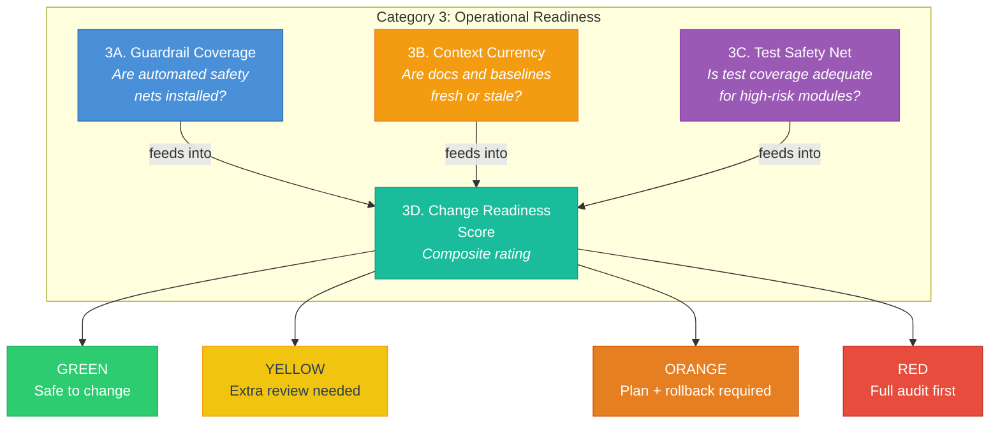

### 3A. Guardrail Coverage

Guardrails are automated checks that run without anyone remembering to invoke them. They are the difference between "we have a process" and "the process enforces itself."

DeepGrade checks for three layers of guardrails, generated by the [gate-generator agent](agents/gate-generator.md) and orchestrated by the [`/deepgrade:codebase-gates`](commands/codebase-gates.md) command:

| Layer | What It Does | Implementation |
| :------ | :------------- | :--------------- |
| **Plugin hooks** | Guard against dangerous operations | Force push guard, migration guard, DB deploy guard |
| **CI quality gates** | Check every PR automatically | PR risk scoring, audit staleness check |
| **Pre-commit hooks** | Catch issues before commit | Risk zone checker for HIGH-risk modules |

A codebase with all three layers has defense in depth. A codebase with none has "we will be careful" as its safety strategy. The audit rates guardrail coverage based on which layers are present and how many HIGH-risk modules from the risk assessment are covered by automated checks.

### 3B. Context Currency

Findings decay. An audit report from 6 months ago might describe a codebase that no longer exists. Context currency measures how fresh your documentation, audit baselines, and findings are.

The [delta-scanner agent](agents/delta-scanner.md) implements confidence decay using a simple time-based model:

```text
  CONFIDENCE DECAY MODEL

  Day 0                30                60                90
   ├──────────────────┼─────────────────┼─────────────────┤
   │     FRESH        │     AGING       │     STALE       │  EXPIRED
   │  No change to    │  Downgrade one  │  Downgrade two  │  Tag with
   │  confidence      │  tier           │  tiers          │  [REQUIRES
   │                  │  (HIGH->MED)    │  (HIGH->LOW)    │  RE-SCAN]
   └──────────────────┴─────────────────┴─────────────────┘
```

A HIGH confidence finding becomes MEDIUM after 31 days, LOW after 61 days, and gets tagged `[REQUIRES RE-SCAN]` after 91 days. This is not arbitrary. It reflects the reality that codebases change continuously, and a finding about module coupling from 3 months ago may not match the current dependency graph.

Delta tracking via [`/deepgrade:codebase-delta`](commands/codebase-delta.md) provides quick re-measurement without a full re-scan. It takes 2-3 minutes and tells you what improved, what regressed, and whether a full scan is warranted. The KPI dashboard tracks 12 metrics over time with trend indicators, making progress visible across multiple scan cycles.

The 12 tracked KPIs are: readiness score, Phase 2 eligibility, monolith file count, largest monolith LOC, test file count, test file ratio, HIGH-risk module count, CRITICAL findings open, stale findings count, days since full scan, config files changed, and security files changed.

### 3C. Test Safety Net

Test coverage numbers can be misleading. 80% line coverage means nothing if the untested 20% contains your payment processing logic. Category 3C focuses specifically on whether HIGH-risk modules (identified by the Phase 2 risk assessment) have adequate test coverage.

The key technique is characterization testing, implemented by the [characterization-generator agent](agents/characterization-generator.md). Characterization tests capture what the code DOES, not what it SHOULD do. The distinction matters for refactoring.

```text
  CHARACTERIZATION TESTS vs UNIT TESTS

  Unit Test:
    "Given input X, the function SHOULD return Y"
    (tests correctness against a specification)

  Characterization Test:
    "Given input X, the function CURRENTLY returns Y"
    (captures behavior before refactoring)

  After refactoring:
    Same input X should still produce Y.
    If it doesn't, the refactoring changed behavior.
```

This approach comes from Michael Feathers' "Working Effectively with Legacy Code" and is adapted for AI-assisted refactoring. Before an AI agent extracts a function from a monolith, characterization tests lock in the current behavior. After extraction, the same tests verify behavioral parity. If a test fails, the extraction changed something it should not have.

### 3D. Change Readiness Score

The Change Readiness Score is a composite rating derived from 3A, 3B, and 3C. It answers the one question that matters before any change: "Is it safe to modify this codebase right now?"

| Rating | Meaning | Action |
| :------- | :-------- | :------- |
| **GREEN** | Safe to change with standard process | Proceed normally |
| **YELLOW** | Change with extra review | Get a second pair of eyes on PRs |
| **ORANGE** | Change only with plan and rollback | Use [`/deepgrade:quick-plan`](commands/quick-plan.md) first |
| **RED** | Do not change without full audit | Run [`/deepgrade:codebase-audit`](commands/codebase-audit.md) first |

A GREEN rating requires all three sub-categories to be healthy: guardrails are installed, context is fresh (under 30 days), and HIGH-risk modules have test coverage. Any gap downgrades the rating.

### The Baseline Maintenance System

Audits produce snapshots. Maintenance turns snapshots into a living system. The baseline maintenance system implemented by [`/deepgrade:codebase-gates`](commands/codebase-gates.md) operates in three layers.

```text
  THE THREE LAYERS OF BASELINE MAINTENANCE

  ┌──────────────────────────────────────────────────────────────┐
  │  LAYER 3: HARD GATES (CI)                                    │
  │  ┌────────────────────────────────────────────────────────┐  │
  │  │  GitHub Actions workflow blocks PRs when:              │  │
  │  │  - HIGH-risk module changed without test update        │  │
  │  │  - Audit baseline older than 30 days                   │  │
  │  │  Starts in ADVISORY MODE for 2 weeks.                  │  │
  │  └────────────────────────────────────────────────────────┘  │
  │                                                              │
  │  LAYER 2: SMART NUDGES (Claude Code hooks)                   │
  │  ┌────────────────────────────────────────────────────────┐  │
  │  │  Threshold-based suggestions:                          │  │
  │  │  - After N file changes: "Run codebase-delta?"         │  │
  │  │  - Config/migration file changed: "Baseline stale?"    │  │
  │  │  - HIGH-risk module touched: "Characterize first?"     │  │
  │  │  - N days since last audit: "Time to re-scan"          │  │
  │  └────────────────────────────────────────────────────────┘  │
  │                                                              │
  │  LAYER 1: PASSIVE TRACKING (always on)                       │
  │  ┌────────────────────────────────────────────────────────┐  │
  │  │  PostToolUse hook counts file changes silently.        │  │
  │  │  No interruptions. No warnings. Just counting.         │  │
  │  │  Provides data for Layer 2 thresholds.                 │  │
  │  └────────────────────────────────────────────────────────┘  │
  └──────────────────────────────────────────────────────────────┘
```

Layer 1 is invisible. The [baseline-tracker script](agents/gate-generator.md) runs as a PostToolUse hook, incrementing a counter every time a file is written or edited. No output, no interruptions. It just counts.

Layer 2 uses that count to trigger contextual nudges. After 15 file changes (configurable via `TP_CHANGE_THRESHOLD`), it suggests running a delta scan. If a config file, migration file, or security-related file is changed, it suggests a targeted re-scan. These are suggestions, not blocks. You can always ignore them.

Layer 3 is optional CI enforcement. A GitHub Actions workflow checks PRs against the audit baseline. For the first 2 weeks after installation, it runs in advisory mode (warnings only). After that, the team can switch to blocking mode. The escalation is gradual by design. Teams that have never had quality gates should not start with hard blocks on day one.

### DORA Metrics Integration

DeepGrade tracks progress against the [DORA four key metrics](https://dora.dev/), the industry standard for software delivery performance since the 2014 State of DevOps report.

| Metric | Elite | High | Medium | Low |
| :------- | :------ | :----- | :------- | :---- |
| Deployment Frequency | Multiple/day | Weekly to monthly | Monthly to biannual | Biannual+ |
| Lead Time for Changes | Under 1 hour | 1 day to 1 week | 1 to 6 months | 6+ months |
| Change Failure Rate | Under 5% | 5-10% | 10-15% | 15%+ |
| Mean Time to Recovery | Under 1 hour | Under 1 day | 1 day to 1 week | 1+ week |

The key finding from DORA research relevant to AI-assisted development: AI tools increase deployment frequency and reduce lead time (good), but change failure rate rises without quality gates (bad). Teams that adopt AI coding assistants without guardrails ship faster and break more things. DeepGrade's Category 3 exists specifically to prevent that tradeoff.

### Operational Readiness Sources

- [Google SRE Book, Chapter 32](https://sre.google/sre-book/launching/) - The original Production Readiness Review covering system architecture, instrumentation, emergency response, capacity, change management, and performance criteria.
- [Cortex: Production Readiness](https://www.cortex.io/) - Tiered maturity model (Bronze/Silver/Gold) that inspired DeepGrade's GREEN/YELLOW/ORANGE/RED change readiness scoring.
- [DORA State of DevOps Report](https://dora.dev/) - The four key metrics that define software delivery performance, now the industry standard for measuring team and codebase health.

---

## 10. Multi-Agent Orchestration

### Why One Agent Is Not Enough

If you have ever asked an AI to "review this entire codebase," you have probably noticed the quality drops as the conversation gets longer. The first few findings are sharp. By finding number 20, the agent is repeating itself or missing obvious issues. This is not a bug. It is a fundamental limitation of how context windows work.

Research from the Claude Code community (GitHub Issue #24256) found that "role specialization degrades after roughly 15-20 iterations." An agent that starts as a focused security reviewer gradually drifts toward general commentary. By the time it has processed 50 files, it is no longer the specialist you asked for.

DeepGrade solves this with multi-agent orchestration: one orchestrator command spawns multiple specialist agents, each with a fresh context window and a specific, scoped objective. The agents write their outputs to the filesystem. After all agents complete, the orchestrator synthesizes and cross-references findings.

### The Fan-Out / Fan-In Pattern

Every DeepGrade command that uses multiple agents follows the same structural pattern.

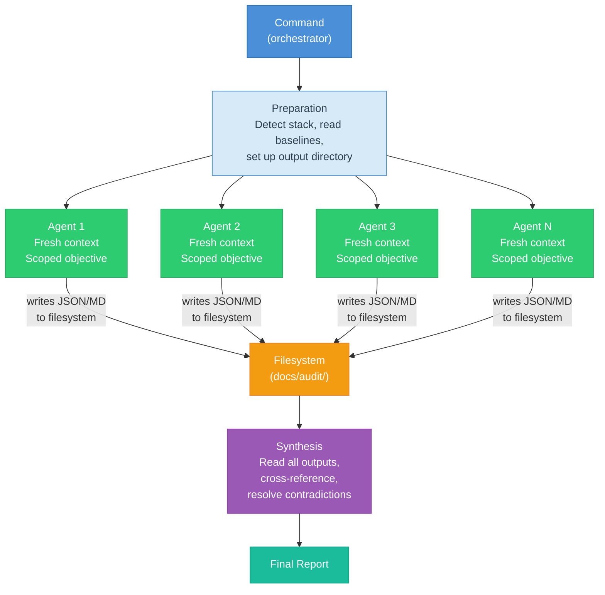

The filesystem is the communication layer. Agents do not pass messages to each other through the orchestrator's context window. They write structured outputs (JSON or Markdown) to `docs/audit/`, and the orchestrator reads those files after all agents complete. This prevents context loss and makes every intermediate result inspectable.

### Agent Deployment Across Commands

Each DeepGrade command deploys a different number of agents, tuned to the complexity of the task.

| Command | Agents | Parallelism | What They Do |
| :-------- | :------: | :------------ | :------------- |
| [`/deepgrade:readiness-scan`](commands/readiness-scan.md) | 10 | All parallel (Phase 2) | 9 scanner agents + 1 report generator, each checking a specific category of AI readiness |
| [`/deepgrade:codebase-audit`](commands/codebase-audit.md) | 6 | 2 phases (3+2, then synthesis) | Phase 1: feature-scanner, dependency-mapper, doc-auditor (parallel). Phase 2: risk-assessor, integration-scanner (parallel). Then synthesis + report. |
| Governance commands | 4 | Per command | [delta-scanner](agents/delta-scanner.md), [gate-generator](agents/gate-generator.md), [security-scanner](agents/security-scanner.md), [characterization-generator](agents/characterization-generator.md) each run as specialized single agents |
| [`/deepgrade:quick-audit`](commands/quick-audit.md) (plan audit) | 5 | All parallel | Architecture, risk, execution, quality reviewers + gap verifier |
| [`/deepgrade:quick-plan`](commands/quick-plan.md) (plan scaffolder) | 3 | All parallel | [Codebase analyst, pattern researcher, test strategist](agents/plan-scaffolder.md) gather evidence before the orchestrator writes the plan |
| [`/deepgrade:troubleshoot`](commands/troubleshoot.md) | Up to 4 | Parallel (if escalated) | Code tracer, git historian, data inspector, integration checker. Only spawned when the bug spans 3+ layers. |

### Why Fresh Context Per Agent

The fresh context window is not a nice-to-have. It is the mechanism that makes specialist agents actually specialize. Here is what happens without it:

```text
  SINGLE AGENT (degraded specialization)

  ┌─────────────────────────────────────────────────────┐
  │  Start: "You are a security reviewer"               │
  │  File 1-5:   Sharp, focused findings                │
  │  File 6-15:  Still good, some repetition            │
  │  File 16-25: Drifting toward general commentary     │
  │  File 26+:   Repeating earlier findings, missing    │
  │              new patterns, role has degraded         │
  └─────────────────────────────────────────────────────┘

  MULTIPLE AGENTS (preserved specialization)

  ┌──────────────────────┐  ┌──────────────────────┐
  │  Agent 1: Security   │  │  Agent 2: Deps       │
  │  Fresh context       │  │  Fresh context        │
  │  5-10 files          │  │  5-10 files           │
  │  Sharp throughout    │  │  Sharp throughout     │
  └──────────────────────┘  └──────────────────────┘
  ┌──────────────────────┐  ┌──────────────────────┐
  │  Agent 3: Docs       │  │  Agent 4: Risk       │
  │  Fresh context       │  │  Fresh context        │
  │  5-10 files          │  │  5-10 files           │
  │  Sharp throughout    │  │  Sharp throughout     │
  └──────────────────────┘  └──────────────────────┘
```

Each agent gets a scoped objective. Not "review this codebase" but "scan all .csproj files for ProjectReference and PackageReference elements, build a project-to-project adjacency list, write to docs/audit/dependency-map.md." The specificity matters. Vague instructions produce vague results regardless of context freshness.

### Scaling Rules

Not every task benefits from multiple agents. Spawning a subagent has overhead: the context window setup, the prompt injection, the filesystem I/O. For small tasks, that overhead costs more than it saves.

The [codebase-audit command](commands/codebase-audit.md) documents the scaling rules:

```text
  WHEN TO USE SUBAGENTS

  1-2 independent tasks:    Just run them sequentially.
                            Subagent overhead is not worth it.

  3+ independent tasks:     Parallel subagents.
                            Time savings exceed overhead.

  5+ independent tasks:     Batch into 3-5 subagent groups.
                            Too many parallel agents can
                            overwhelm the filesystem.
```

The codebase audit scales its agent count to match codebase size. Small codebases (under 10 modules) get 2-3 subagents per phase. Medium codebases (10-30 modules) get 3-5. Large codebases (30+) get 5-8. This prevents both under-analysis (too few agents for a large codebase) and over-analysis (too many agents producing redundant findings for a small project).

### Model Selection Strategy

DeepGrade uses two models for different types of work. The selection is not arbitrary. It maps to the cognitive demands of each task.

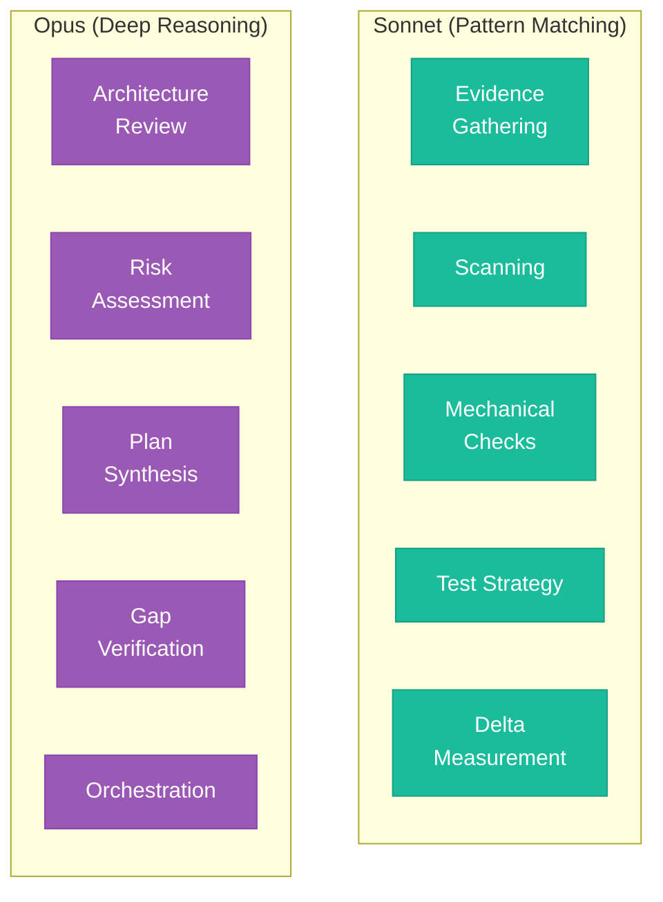

**Opus** handles tasks that require reasoning about tradeoffs, evaluating failure scenarios, synthesizing conflicting evidence, or making judgment calls. Architecture review ("is this design sound for THIS codebase?") needs Opus. Risk assessment ("what is the most likely failure mode?") needs Opus. Synthesis ("these 5 agent reports contradict each other on module X, which is right?") needs Opus.

**Sonnet** handles tasks that are read-heavy, pattern-matching, or mechanical. Scanning a codebase for test files is pattern matching. Counting monolith files is mechanical. Gathering evidence from a plan document is read-heavy. Sonnet does these well and costs less.

The [plan-auditor](agents/plan-auditor.md) demonstrates the split clearly: Architecture and Risk reviewers use Opus (reasoning about tradeoffs and failure scenarios), while Execution and Quality reviewers use Sonnet (mechanical assessment of whether a timeline or test plan exists). The [plan-scaffolder](agents/plan-scaffolder.md) uses the same split: 3 Sonnet analysts gather evidence, then an Opus orchestrator synthesizes the findings into a cohesive plan.

### The Troubleshooting Escalation Pattern

The [`/deepgrade:troubleshoot`](commands/troubleshoot.md) command shows a different orchestration pattern: conditional escalation. Most bugs do not need multiple agents. A null reference exception in a single file is investigated perfectly well by one agent.

But some bugs span multiple layers: the UI shows the wrong data, the API returns the wrong response, the database has the wrong value, and the migration that changed the schema ran 3 commits ago. Investigating this serially means context-switching between frontend, backend, database, and git history, losing focus at each transition.

The troubleshoot command starts with a single agent for Phase 1 (Root Cause Investigation). If the bug meets escalation criteria (spans 3+ layers, 2+ competing hypotheses, or requires holding 4+ mental contexts), the orchestrator offers to switch to multi-agent mode. If the user agrees, up to 4 specialist agents (code tracer, git historian, data inspector, integration checker) investigate in parallel, and the orchestrator synthesizes their findings into a unified root cause.

This conditional escalation avoids the overhead of multi-agent mode for simple bugs while providing it for the complex cross-layer issues where it genuinely helps.

### Multi-Agent Orchestration Sources

- [Anthropic: code-review plugin](https://github.com/anthropics/claude-code/tree/main/plugins/code-review) - Uses 5 parallel Sonnet agents for different review aspects (correctness, style, performance, security, documentation), validating the specialist-per-domain pattern.
- [Anthropic: pr-review-toolkit](https://github.com/anthropics/claude-code/tree/main/plugins/pr-review-toolkit) - Uses 6 specialized agents, confirming that Anthropic's own plugins adopt the fan-out/fan-in orchestration model at scale.

---

## 11. The Zero-Dependency Principle

### Why Dependencies Are the Enemy

Here is a fun rule of thumb: the number of machines where your safety hooks will fail silently is directly proportional to the number of dependencies those hooks require. DeepGrade learned this the hard way, across four painful versions.

The goal from day one was simple. Seven safety hooks, all running inside Claude Code's bash environment, all parsing JSON from stdin, all making pass/block decisions. The problem was JSON parsing. Bash does not have a built-in JSON parser. So you reach for a tool. And that is where the trouble starts.

### The Four Failures

Every version of the hook system that relied on an external tool eventually broke on someone's machine. Here is the timeline, and each failure taught us something specific.

| Version | Approach | Failure | Result | Lesson |
| :------ | :------- | :------ | :----- | :----- |
| v4.14 | python3 in hooks | Git Bash on Windows did not have python3 on PATH. | All 7 hooks exited silently with no guard behavior. | "Available on most systems" is not good enough for safety infrastructure. |
| v4.21 | jq required | Developer machines without jq installed. | All 7 hooks exited silently. | A single required binary breaks the zero-config promise. |
| v4.26 | jq installed but invisible | winget installed jq to AppData, but Git Bash could not see it. | jq failed, hooks exited 0, and all guards were bypassed. | "Installed" and "on PATH" are different reliability states. |
| v4.26.1 | grep+sed only | Nested JSON, escaped quotes, and multiline values. | Partial parsing, missed fields, and false positives. | grep+sed works for flat JSON but breaks on real payloads. |

> Visual cue: this is a graveyard, not a timeline. Each row is a discarded architecture pattern that failed a reliability test.

The v4.26 failure was the worst. A developer had jq installed via `winget install jqlang.jq`. It worked in PowerShell. It worked in CMD. But Git Bash (where Claude Code hooks run) uses a different PATH. The `jq` command failed, the `set -e` wasn't set (because hooks need to handle errors gracefully), and the hook exited 0. Every safety guard was silently bypassed. Force pushes, migration edits, direct database deploys. All allowed.

That is the failure mode we designed the current system to prevent.

### The Current Solution: Graceful Degradation

The architecture that shipped in v4.27 uses a three-layer fallback chain. Every hook follows the same pattern.

```mermaid
flowchart TD
    START["Hook receives JSON on stdin"] --> PREAMBLE["PATH preamble<br/><code>export PATH=$PATH:$LOCALAPPDATA/Microsoft/WinGet/Links:/usr/local/bin</code>"]
    PREAMBLE --> JQ_CHECK{"jq available?"}

    JQ_CHECK -->|"Yes"| JQ_PARSE["Parse with jq<br/><code>jq -r '.tool_input.command // empty'</code>"]
    JQ_CHECK -->|"No"| GREP_PARSE["Parse with grep+sed<br/><code>grep -o '\"command\":\"[^\"]*\"' | sed ...</code>"]

    JQ_PARSE --> JQ_RESULT{"Field extracted?"}
    JQ_RESULT -->|"Yes"| EVALUATE["Evaluate safety rules"]
    JQ_RESULT -->|"No (empty)"| GREP_PARSE

    GREP_PARSE --> GREP_RESULT{"Field extracted?"}
    GREP_RESULT -->|"Yes"| EVALUATE
    GREP_RESULT -->|"No"| SAFE_EXIT["exit 0<br/>(input doesn't match,<br/>not a security concern)"]

    EVALUATE --> BLOCK{"Dangerous<br/>operation?"}
    BLOCK -->|"Yes"| EXIT2["exit 2 + warning<br/>BLOCKED"]
    BLOCK -->|"No"| EXIT0["exit 0<br/>ALLOWED"]

    style START fill:#4A90D9,stroke:#2C6FAC,color:#fff
    style PREAMBLE fill:#F39C12,stroke:#E67E22,color:#fff
    style JQ_CHECK fill:#8E44AD,stroke:#6C3483,color:#fff
    style JQ_PARSE fill:#2ECC71,stroke:#27AE60,color:#fff
    style GREP_PARSE fill:#E67E22,stroke:#D35400,color:#fff
    style EVALUATE fill:#3498DB,stroke:#2980B9,color:#fff
    style EXIT2 fill:#E74C3C,stroke:#C0392B,color:#fff
    style EXIT0 fill:#2ECC71,stroke:#27AE60,color:#fff
    style SAFE_EXIT fill:#95A5A6,stroke:#7F8C8D,color:#fff
```

The PATH preamble is the first key insight. On Windows, `winget` installs binaries to `$LOCALAPPDATA/Microsoft/WinGet/Links`, which Git Bash does not include in its default PATH. On macOS/Linux, `/usr/local/bin` is the standard location for user-installed tools. By prepending both before every `jq` call, we cover the most common "installed but invisible" scenarios.

Source: [`.claude-plugin/plugin.json`](https://github.com/krwhynot/deepgrade/blob/main/.claude-plugin/plugin.json) -- every hook command begins with the PATH preamble.

### The Five Design Rules

These emerged from the four failures above. They are non-negotiable in any future hook development.

```text
  ┌─────────────────────────────────────────────────────────────────┐
  │              THE FIVE RULES OF HOOK DESIGN                      │
  ├─────────────────────────────────────────────────────────────────┤
  │                                                                 │
  │  1. NEVER FAIL OPEN                                             │
  │     If the guard can't parse its input, BLOCK, don't allow.     │
  │     Exception: non-matching inputs (exit 0 is correct).         │
  │                                                                 │
  │  2. JQ FIRST, GREP+SED SECOND                                  │
  │     Try jq with the PATH preamble. If jq is unavailable or     │
  │     returns empty, fall back to grep+sed extraction.            │
  │                                                                 │
  │  3. WARN ON STARTUP IF JQ MISSING                               │
  │     The SessionStart hook checks for jq and prints a warning    │
  │     to stderr if it's not found. The user sees it once per      │
  │     session, not once per hook invocation.                      │
  │                                                                 │
  │  4. STOP HOOKS MUST EXIT 0                                      │
  │     On the Stop event, exit 2 causes Claude Code to retry the   │
  │     stop, creating an infinite loop. Stop hooks can warn but    │
  │     must ALWAYS exit 0.                                         │
  │                                                                 │
  │  5. ALL INPUT COMES FROM STDIN                                  │
  │     Hooks receive a JSON blob on stdin with tool_input fields.  │
  │     No file arguments, no environment variable contracts, no    │
  │     assumptions about working directory.                        │
  │                                                                 │
  └─────────────────────────────────────────────────────────────────┘
```

### How Each Hook Implements the Pattern

Every hook in the plugin follows the same structural template. Here is how the pattern maps across all seven hooks.

| Hook | Event | Matcher | What It Parses | jq Path | grep+sed Fallback | Security Level |
| :----- | :------ | :-------- | :--------------- | :-------- | :----------------- | :--------------- |
| [SessionStart](https://github.com/krwhynot/deepgrade/blob/main/.claude-plugin/plugin.json#L21) | SessionStart | `*` | session context | N/A (no JSON parsing) | `ls -td`, `basename` | Informational |
| [Git Guard](https://github.com/krwhynot/deepgrade/blob/main/.claude-plugin/plugin.json#L46) | PreToolUse | `Bash` | `tool_input.command` | `jq -r ".tool_input.command"` | `grep -o '"command":"[^"]*"'` | **Blocking** |
| [Migration Guard](https://github.com/krwhynot/deepgrade/blob/main/.claude-plugin/plugin.json#L36) | PreToolUse | `Write\|Edit` | `tool_input.file_path` | `jq -r ".tool_input.file_path"` | `grep -o '"file_path":"[^"]*"'` | **Blocking** |
| [DB Deploy Guard](https://github.com/krwhynot/deepgrade/blob/main/.claude-plugin/plugin.json#L46) | PreToolUse | `Bash` | `tool_input.command` | `jq -r ".tool_input.command"` | `grep -o '"command":"[^"]*"'` | **Blocking** |
| [Change Tracker](https://github.com/krwhynot/deepgrade/blob/main/.claude-plugin/plugin.json#L58) | PostToolUse | `Write\|Edit` | `session_id` | `jq -r ".session_id"` | `grep -o '"session_id":"[^"]*"'` | Informational |
| [Test/Build Tracker](https://github.com/krwhynot/deepgrade/blob/main/.claude-plugin/plugin.json#L68) | PostToolUse | `Bash` | `tool_input.command` | `jq -r ".tool_input.command"` | `grep -o '"command":"[^"]*"'` | Informational |
| [Stop Summary](https://github.com/krwhynot/deepgrade/blob/main/.claude-plugin/plugin.json#L77) | Stop | `*` | `session_id` | `jq -r ".session_id"` | `grep -o '"session_id":"[^"]*"'` | Informational |

The three blocking hooks (Git Guard, Migration Guard, DB Deploy Guard) are the ones where the fail-open problem matters most. If any of them cannot parse the input and the input actually contains a dangerous command, we have a security hole. That is why the jq-first-then-grep pattern exists.

Source: [scripts/dg-git-guard.sh](https://github.com/krwhynot/deepgrade/blob/main/scripts/dg-git-guard.sh), [scripts/dg-migration-guard.sh](https://github.com/krwhynot/deepgrade/blob/main/scripts/dg-migration-guard.sh), [scripts/dg-session-start.sh](https://github.com/krwhynot/deepgrade/blob/main/scripts/dg-session-start.sh)

### The grep+sed Pattern Up Close

When jq is not available, every hook falls back to the same extraction pattern. It looks ugly but it is battle-tested on flat JSON payloads.

```bash
# jq path (preferred)
COMMAND=$(echo "$INPUT" | jq -r ".tool_input.command // empty" 2>/dev/null)

# grep+sed fallback (if jq returned empty or failed)
[ -z "$COMMAND" ] && \
  COMMAND=$(echo "$INPUT" | grep -o '"command":"[^"]*"' | head -1 | sed 's/"command":"//;s/"$//')
```

The `// empty` in the jq expression is important. Without it, jq returns the string `"null"` for missing fields, which would pass the `-z` check and skip the fallback. With `// empty`, jq returns an actual empty string, triggering the grep+sed path correctly.

The `head -1` in the grep path handles the case where `"command"` appears multiple times in the JSON (it can, in nested structures). We always take the first match, which corresponds to the top-level field.

Source: [`.claude-plugin/plugin.json`](https://github.com/krwhynot/deepgrade/blob/main/.claude-plugin/plugin.json) lines 49, 61, 71, 83

### Why Not Just Require jq?

Because "just require jq" is how we got v4.21. The moment you add a required dependency, you have two problems:

1. **Discovery**: How does the user find out they need jq? A README line? A startup error? An install script? Every one of these has a failure mode.
2. **Enforcement**: What happens when jq is missing? If you block everything, the plugin is unusable. If you allow everything, the safety hooks are theater.

The current design sidesteps both problems. jq is optional but recommended. If it is present, you get robust JSON parsing. If it is absent, you get a one-time warning and fallback parsing that handles the common cases. The plugin never stops working entirely, and the safety hooks never silently turn off.

| Approach | Strength | Failure Mode | Verdict |
| :------- | :------- | :----------- | :------ |
| **Required dependency** | Best quality when the tool is present. | The whole safety system degrades when the dependency is missing. | Bad default for safety hooks. |
| **Optional + fallback** | Works everywhere and improves when jq is available. | More implementation complexity, but failure stays controlled. | The DeepGrade sweet spot. |
| **Pure Bash** | No dependency management burden. | Fragile parsing on real-world payloads and edge cases. | Risky unless inputs are extremely simple. |

> Visual cue: this is a tradeoff matrix, not a purity contest. DeepGrade chooses the middle column because reliability matters more than elegance.

The sweet spot is in the middle. That is where DeepGrade lives.

---

## 12. Sources Index

Every source cited in this methodology, organized by topic. Each entry includes a one-sentence summary of the key insight that informed DeepGrade's design.

### AI-Ready Codebases

- [Matt Pocock: "Your codebase is NOT ready for AI"](https://www.aihero.dev/how-to-make-codebases-ai-agents-love~npyke) - The 8 principles for AI-ready codebases, treating AI agents like a constantly arriving new starter who needs clear signposts to navigate your code.
- [Derick Chen: "Your code base isn't ready for AI"](https://www.buildwithdc.co/posts/your-code-base-isnt-ready-for-ai/) - Identifies 5 enterprise code smells that break AI agents: poor structure, distributed logic, acronyms, missing comments, and documentation distance from code.
- [Mark Mishaev: AI Harness Scorecard](https://github.com/markmishaev76/ai-harness-scorecard) - A deterministic scorecard with 31 checks across 5 categories, proving that AI readiness can be measured with numbers rather than opinions.
- [OpenAI: Harness Engineering](https://openai.com/index/harness-engineering/) - Introduces Context Engineering, Architectural Constraints, and Entropy Management, arguing that "the model is commodity, the harness is moat."
- [Shaharia Azam: AI Integration Framework](https://shaharia.com/blog/ai-integration-framework/) - Quality gates, AI-navigable context, and frictionless workflow, all built on a zero-trust mindset for AI contributions.
- [SuperGok: Agent Readiness Framework](https://supergok.com/agent-readiness-framework/) - An assessment framework spanning 8 axes and 5 maturity levels for measuring how ready a codebase is for autonomous agents.
- [NxCode: Harness Engineering Complete Guide](https://www.nxcode.io/resources/news/harness-engineering-complete-guide-ai-agent-codex-2026) - A comprehensive walkthrough of harness engineering patterns for AI coding agents, covering context injection, constraint systems, and feedback loops.
- [Developer Toolkit: File Organization for AI](https://developertoolkit.ai/en/shared-workflows/context-management/file-organization/) - File organization patterns that help AI assistants discover and navigate project structure without needing to ask.
- [Basti Ortiz: Coding Agents as First-Class Consideration](https://dev.to/somedood/coding-agents-as-a-first-class-consideration-in-project-structures-2a6b) - The 40% context window rule: if your agent spends more than 40% of its context on orientation, it has less than 60% left for actual work; vertical slicing beats horizontal for agent-friendly structure.

### CLAUDE.md Best Practices

- [Tembo: How to Write a Great CLAUDE.md](https://www.tembo.io/blog/how-to-write-a-great-claude-md) - "Even the best frontier models can only reliably follow around 200 distinct instructions," making brevity a functional requirement.
- [HumanLayer: Writing a Good CLAUDE.md](https://www.humanlayer.dev/blog/writing-a-good-claude-md) - "Never send an LLM to do a linter's job"; reveals that Claude Code wraps CLAUDE.md with an advisory caveat, meaning the agent already treats it as potentially disposable.
- [Allahabadi.dev: 7 CLAUDE.md Mistakes](https://allahabadi.dev/blogs/ai/7-claude-md-mistakes-developers-make/) - Reports that Boris Cherny (Claude Code creator) keeps his team's file at 2.5K tokens (roughly 100 lines), setting a practical upper bound.
- [Builder.io: CLAUDE.md Guide](https://www.builder.io/blog/claude-md-guide) - A comprehensive guide to structuring effective CLAUDE.md files with concrete patterns for instruction organization and prioritization.
- [Buildcamp: Ultimate Guide to CLAUDE.md](https://www.buildcamp.io/guides/the-ultimate-guide-to-claudemd) - End-to-end walkthrough of CLAUDE.md authoring, covering structure, anti-patterns, and real-world examples from production codebases.
- [Ogenki Blog: AI Coding Tips](https://blog.ogenki.io/post/series/agentic_ai/ai-coding-tips) - "CLAUDE.md is advisory (Claude CAN ignore). Hooks are deterministic (always run)." The distinction that shaped DeepGrade's entire hook architecture.

### Production Readiness

- [Google SRE Book Ch. 32: The Evolving SRE Engagement Model](https://sre.google/sre-book/launching/) - The Production Readiness Review framework covering system architecture, instrumentation, emergency response, capacity planning, change management, and performance.
- [Cortex: Production Readiness](https://www.cortex.io/) - Bronze, Silver, and Gold maturity tiers for production readiness, providing a graduated model that DeepGrade adapted for its own tiering system.
- [GitLab: Production Readiness Review](https://handbook.gitlab.com/handbook/engineering/infrastructure/production/readiness/) - "Enough documentation, observability, and reliability for production scale," defining the minimum bar for shipping safely.
- [Supabase: Managing Environments](https://supabase.com/docs/deployment/managing-environments) - "Use a CI/CD pipeline rather than deploying from your local machine," the principle behind DeepGrade's DB Deploy Guard.
- [DORA: DevOps Research and Assessment](https://dora.dev/) - The four key metrics for software delivery performance (deployment frequency, lead time, change failure rate, time to restore), providing the empirical foundation for what "good" delivery looks like.

### Context Engineering

- [Steven Poitras: Three-Tier Context System](https://agenticthinking.ai/blog/three-tier-context/) - A tiered context architecture (Ephemeral, Internal, Public, Rules) that maps directly to DeepGrade's always-loaded, conditionally-loaded, and on-demand context strategy.
- [Colin McDonnell (Zod): AI Autodiscovery in package.json](https://colinhacks.com/essays/ai-autodiscovery-in-package-json) - Proposes standardized fields in package.json that let AI agents discover project capabilities without parsing documentation.
- [Ryan Walker: AGENTS.md Standard](https://rywalker.com/research/agents-md-standard) - A proposed standard for agent context files, providing structured metadata that AI agents can consume to understand project conventions and constraints.

### Claude Code Plugin Architecture

- [Anthropic: Official Plugin Examples](https://github.com/anthropics/claude-code/tree/main/plugins) - The official repository of Claude Code plugin examples and patterns that DeepGrade's plugin structure is built on.
- [Anthropic: Plugin File Structure](https://github.com/anthropics/claude-code/blob/main/plugins/plugin-dev/skills/plugin-structure/SKILL.md) - The canonical reference for how plugins organize their files, defining the `.claude-plugin/plugin.json`, `commands/`, `agents/`, `skills/`, and `scripts/` directories.
- [Claude Code: Hooks Guide](https://docs.claude.com/en/docs/claude-code/hooks-guide) - Official documentation for the hooks system, covering event types (SessionStart, PreToolUse, PostToolUse, Stop, PreCompact), matchers, exit codes, and stdin JSON format.
- [Claude Code: Memory](https://code.claude.com/docs/en/memory) - Documentation for Claude Code's memory and context file system, explaining how CLAUDE.md, CLAUDE.local.md, and child context files interact.

### Database and CI/CD

- [Supabase: Agent Skills](https://github.com/supabase/agent-skills) - A library of AI agent skills for database operations, demonstrating safe patterns for agent-driven schema changes.
- [Supabase: Database Migrations](https://supabase.com/docs/guides/deployment/database-migrations) - Migration best practices including the "never edit a deployed migration" principle that DeepGrade's Migration Guard enforces.
- [Supabase: Branching](https://supabase.com/docs/guides/deployment/branching) - Environment branching for databases, enabling preview environments where AI agents can safely test schema changes before they hit production.

---

*Sources last verified: March 2026. If a link is dead, search for the author name and article title.*
