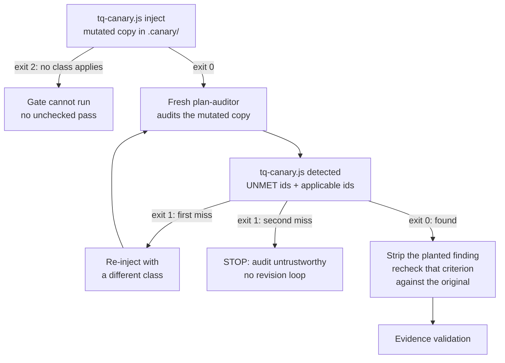
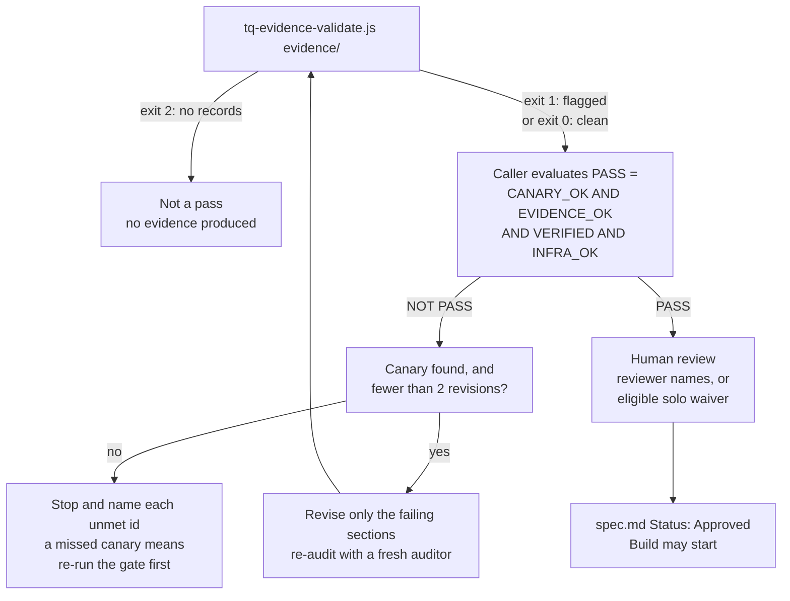
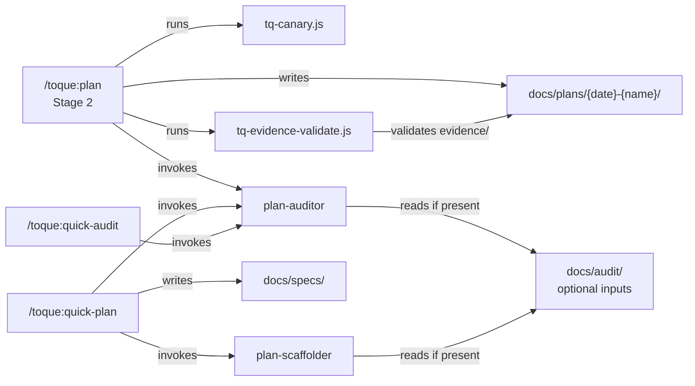
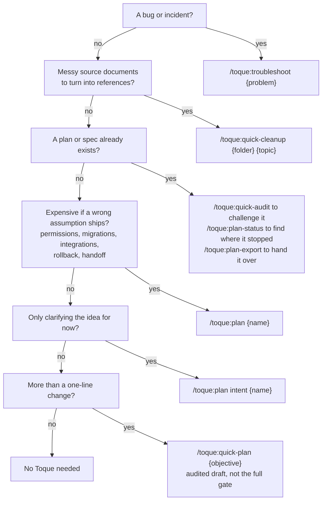
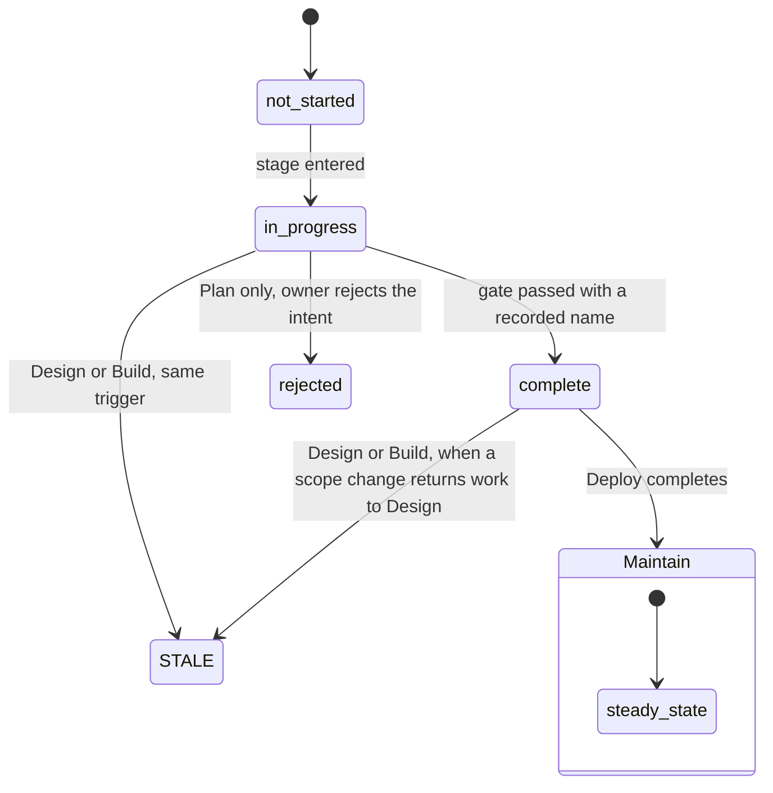
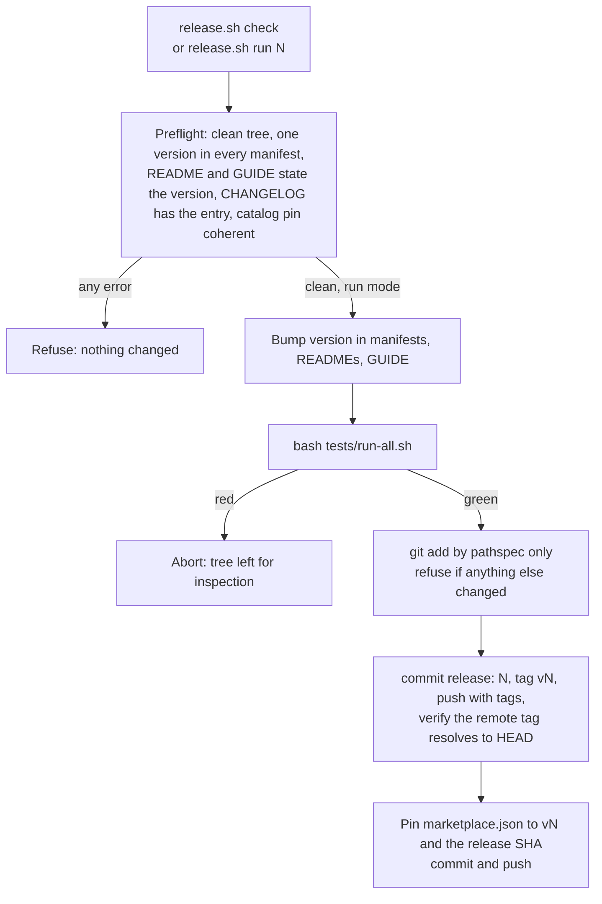
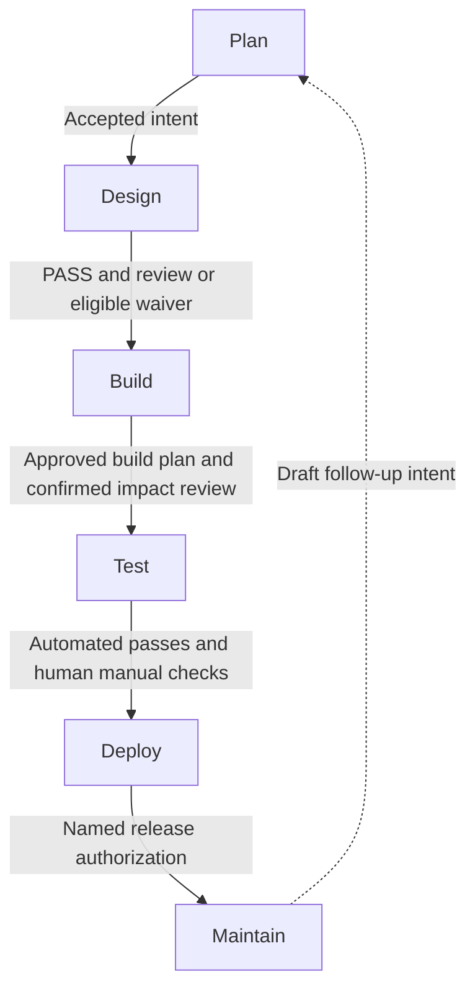

# Visual proposals — ready-to-insert drafts

Companion to [audit.md](audit.md) (scope, coverage, register) and [verification.md](verification.md) (rendering and factual checks). Nothing here has been applied to a published page.

Every draft follows the same shape: target file and heading, the reader question, the source (Mermaid or Markdown table), an introductory sentence, a plain-text explanation that survives a failed render, evidence, nearby prose to shorten, and the facts that would force the visual to change. Line references are to the working tree at commit `95c53af` plus uncommitted edits, as recorded in audit.md.

Conventions used in every Mermaid draft: no `style`/`classDef` fills, no HTML labels, no `click` directives, top-down layout, at most five nodes across, and status conveyed by the label text (`exit 0`, `STOP`, `PASS`) rather than by colour. Chef wording appears only in captions.

---

## V1 — Where Toque lives and what it writes (install.md)

**Target:** `documentation/install.md`, new subsection `## What gets installed, and what gets written` placed between `## Verify` (line 39) and `## Update an installed copy` (line 51).

**Reader question:** What does installing Toque add to Claude Code, and what will appear in my project?

**Introductory sentence:** Installing adds capabilities to Claude Code; nothing is written into your project until you run a command.

**Table:**

```markdown
| Where | What appears | When |
| --- | --- | --- |
| Claude Code's plugin cache (versioned; not your repository) | The `toque` plugin: 6 command files, 5 skills, 2 agents, `hooks/hooks.json`, 5 Node scripts, document templates | At `claude plugin install` |
| Your Claude Code settings for the chosen scope (`user`, `project`, or `local`) | The enabled-plugin entry that makes `/toque:*` available | At install; `--scope project` writes to the repository's shared settings |
| Every session in a project | Three informational hooks run on SessionStart, SubagentStop, and PreCompact; they read `docs/plans/` and never create files | Automatically, after install and reload |
| `docs/plans/YYYY-MM-DD-{name}/` in your project | The plan workspace (`intent.md`, `spec.md`, `audit.md`, `evidence/`, `plan.md`, `review.md`, …) | Only when you run `/toque:plan`, `/toque:quick-cleanup`, or a plan-linked command |
| `docs/specs/{name}.md` | A standalone spec | Only when you run `/toque:quick-plan` |
| `docs/troubleshooting/` | Standalone troubleshooting logs and `knowledge-base.md` | Only when you run `/toque:troubleshoot` without a plan |
| `{plan-name}-export.zip` at the project root | A portable plan package | Only when you run `/toque:plan-export` |
| `docs/audit/` | Nothing. Toque reads analysis another tool left there; it does not write it | Never written by Toque |
```

**Text explanation (if the table does not render):** Installation places the plugin in Claude Code's versioned cache and records it in the settings for the scope you chose. The three hooks start running automatically but only read plan folders. Files appear in your project only when a command runs: the plan workspace under `docs/plans/`, standalone specs under `docs/specs/`, troubleshooting logs under `docs/troubleshooting/`, and an export zip at the project root. `docs/audit/` is read-only input.

**Evidence:**

- Plugin contents and cache: `plugins/toque/README.md:150-156` (component counts); `documentation/install.md:64` ("Installed plugins use a versioned cache"); `plugins/toque/hooks/hooks.json:1-46` (three events, Node scripts).
- Scopes: `documentation/install.md:29-37`; `--scope project` shared settings at line 34.
- Hooks never create files: `plugins/toque/scripts/tq-subagent-stop.js:36-39` ("Never create it"); `tq-session-start.js:44-58` and `tq-pre-compact.js:22-36` only read.
- Plan workspace creation: `plugins/toque/skills/plan/SKILL.md:169-176` (`mkdir -p` at new plan); `plugins/toque/commands/quick-cleanup.md:17-23` (creates a homebase).
- `docs/specs/`: `plugins/toque/commands/quick-plan.md:9-16`.
- `docs/troubleshooting/`: `plugins/toque/skills/troubleshoot/SKILL.md:116`; `plugins/toque/GUIDE.md:249-251`.
- Export zip: `plugins/toque/commands/plan-export.md:352-371`; `plugins/toque/GUIDE.md:253`.
- `docs/audit/` read-only: `interop.md:5`; `plugins/toque/commands/help.md:144-149`.

**Nearby prose to shorten:** None required. The paragraph at `install.md:64` about the versioned cache can stay; the table makes its point concrete.

**Facts that would change this visual:** any new command that writes a new location; a hook that creates directories; a change to install scopes in Claude Code; a producer of `docs/audit/` files shipping inside Toque.

**Caveats to state beside the table:** The exact cache path and settings file names are Claude Code's, not Toque's, so the table names the scope rather than a path. Note also that the SubagentStop hook appends to `troubleshooting/subagent-log.txt` only when that directory already exists (`tq-subagent-stop.js:36-39`), which is a write into an existing plan folder, not a new file location.

---

## V1b — Dependencies: required, optional, conditional (install.md)

**Target:** `documentation/install.md`, replace the two-row table under `## Prerequisites` (lines 11-14) and fold the `## Optional inputs` section (lines 106-110) into it. Keep the sentence at line 16 about checking Node separately.

**Reader question:** Which dependencies are required, optional, or conditional?

**Introductory sentence:** Only two things are required; the rest are used when a specific command needs them and each has a stated fallback.

**Table:**

```markdown
| Dependency | Status | Used by | If absent |
| --- | --- | --- | --- |
| Claude Code | Required | Everything | Nothing runs |
| Node.js 18+ on PATH | Required | The 3 hooks and the 2 design-gate tools (`tq-canary.js`, `tq-evidence-validate.js`) | Hook errors on each event; Stage 2 cannot pass. There is no fallback that turns a missing check into a pass |
| Git | Conditional | Stage 5 diff-versus-plan; Stage 3 traceability check | Those checks cannot run |
| `python3` or `python` | Conditional | `plan-status` overview and `troubleshoot` plan detection (JSON read, falls back to `grep`); `quick-cleanup` PDF, Word, and CSV extraction fallbacks | Status still reports via a weaker `grep` read; unreadable source files are marked for manual review |
| `pdftotext`, `pandoc` | Conditional | `quick-cleanup` PDF and Word extraction | Python fallback, then `[MANUAL REVIEW REQUIRED]` |
| `zip`, PowerShell `Compress-Archive`, or `tar` | Conditional | `plan-export` archive step | No archive; staging directory is left for inspection |
| MCP search tools (Ref, Exa, Perplexity) | Optional | Stage 1 research, `troubleshoot` external context, documentation enrichment | Built-in web tools; if none, findings are tagged `[EXTERNAL RESEARCH UNAVAILABLE]` |
| `docs/audit/*` analysis from another tool | Optional | Auditor, scaffolder, quick-plan, templates (see [Interop](../interop.md)) | Workflows continue on project evidence |
```

**Text explanation:** Claude Code and Node.js 18+ are required. Git, Python, `pdftotext`, `pandoc`, and an archiver are needed only by the commands that call them, and each command names its fallback. MCP search tools and external `docs/audit/` files are optional and enrich research.

**Evidence:**

- Node required, no fallback: `documentation/install.md:104`; `plugins/toque/README.md:132-135`; `METHODOLOGY.md:622-631`.
- Git: `plugins/toque/skills/plan/stages/stage-5-deploy.md:6,37`; `stage-3-build.md:303-309`.
- Python with grep fallback: `plugins/toque/commands/plan-status.md:27-44`; `plugins/toque/skills/troubleshoot/SKILL.md:91-109`; `plugins/toque/commands/quick-cleanup.md:184-247`.
- `pdftotext`/`pandoc`: `quick-cleanup.md:198-234`; manual review marker at `:252-253`.
- Archivers: `plugins/toque/commands/plan-export.md:357-369`.
- MCP optional and the tag: `documentation/install.md:108`; `plugins/toque/skills/plan/stages/stage-1-plan.md:131-151`.
- `docs/audit/` optional: `interop.md:5,19-29`.
- "Command snippets may need Bash utilities, Python, document converters, or an archiver": `METHODOLOGY.md:628-630`.

**Nearby prose to shorten:** `install.md:106-110` (`## Optional inputs`) becomes redundant and can be reduced to the interop link.

**Facts that would change this visual:** a change to the Node floor; a script gaining a non-Node dependency; a command dropping or adding a converter fallback.

---

## V2 — Who reads, writes, and decides at each stage (the-plan-workflow.md)

**Target:** `documentation/the-plan-workflow.md`, new subsection `### Reads, writes, and decisions` directly after `### Approval tiers` (line 39) and before `## Stage 1 — Plan` (line 41).

**Reader question:** Which files does each stage read and create, and who approves what?

**Introductory sentence:** Each stage reads the previous artifact, writes its own, and stops at a decision a named human records.

**Table:**

```markdown
| Stage | Reads | Writes | Executable check | Human decision |
| --- | --- | --- | --- | --- |
| Plan | Your idea, ticket, or `from` folder; the codebase; search tools | `intent.md`, `research/findings.md`, `research/reference-data.json`, `research/intake/` | None | Named product owner sets `Status: Accepted` |
| Design | `intent.md` (Accepted), `research/findings.md`, `research/reference-data.json` | `spec.md`, `audit.md`, `evidence/`, `.canary/` (scratch) | `tq-canary.js` and `tq-evidence-validate.js`, run by the caller | Scope lock; reviewer name or eligible solo waiver; `Status: Approved` |
| Build | `spec.md` (Approved), `audit.md`, assumptions in `status.json` | `plan.md`, `changes/CR-{N}.md`, `impact-review.md`; code only on approval | None (assumption gate is an instruction) | Approve `plan.md`; approve each codebase action; waive a HIGH assumption; confirm impact review |
| Test | `spec.md` Verification plan, `plan.md` Proof and Verification, `audit.md`, `impact-review.md`, `status.json` | `test-plan.md`, `status.json` test gate | Tier 1 automated tests, run with approval | Confirm every Tier 2 manual check by name |
| Deploy | `intent.md` Constraints, `plan.md`, `test-plan.md`, `status.json`, `git diff` | `review.md`, `plan.md` Departures from plan | Fresh subagent compares diff with plan (a report, not a check) | Named human records Authorized, Rejected, or Deferred, then performs the release |
| Maintain | The plan folder, `troubleshooting/` logs, `docs/troubleshooting/knowledge-base.md` | `status.json` maintain metrics; a new draft `intent.md` when the trigger fires | None | Accept or reject the new intent back in Plan; never auto-accepted |
```

**Text explanation:** Plan produces an accepted intent. Design produces the spec, the audit, and its evidence, with the canary and evidence validator as the only executable checks in the workflow; humans lock scope and record review. Build produces the build plan, change records, and the impact review, with every codebase action approved individually. Test produces the test plan; automated checks run, manual checks are confirmed by a person. Deploy produces the review and a named release decision; the human performs the release. Maintain reads incident logs and can only propose a new intent.

**Evidence:** the `Reads:` / `Produces:` / `Gate:` headers of each stage file: `stage-1-plan.md:6-8`, `stage-2-design.md:6-8`, `stage-3-build.md:6-8`, `stage-4-test.md:6-8`, `stage-5-deploy.md:6-8`, `stage-6-maintain.md:6-8`. Executable checks: `stage-2-design.md:534-537,548-553,588-591`. Build approvals: `stage-3-build.md:82-94,107-136,171-174,417-428`. Test tiers: `stage-4-test.md:106-146`. Deploy: `stage-5-deploy.md:25-38,98-128`. Maintain: `stage-6-maintain.md:24-47`. Summary form in `plugins/toque/skills/plan/SKILL.md:62-76`.

**Nearby prose to shorten:** Each stage section's `**Produces:**` line (`the-plan-workflow.md:45,78,126,164,183,203`) can remain as-is; the table adds the reads and the executable-versus-human split that the page currently leaves implicit.

**Facts that would change this visual:** a new artifact in any stage; a new executable check; a change in which decisions require a name.

**Withheld relationship:** the Deploy row says "performs the release" per `stage-5-deploy.md:126`. Stage 5 Step D then marks the stage complete and prints "Released" after authorization is recorded (`stage-5-deploy.md:130-137`), which the conformance audit records as unresolved decision D4. The table describes the instruction to the human; it does not claim the recorded status proves a deployment happened.

---

## V3 — The design gate, with its failure paths (the-design-gate.md)

Two diagrams, because the gate has two distinct questions: is the auditor awake, and do the verdicts survive checking. Each stays under five nodes wide.

### V3a — Canary: checking the auditor

**Target:** `documentation/the-design-gate.md`, inside `## 1. Check whether the auditor notices a known defect`, after the paragraph ending "The original design is not the scratch copy." (line 29).

**Reader question:** What happens when the auditor misses the planted defect?

**Introductory sentence:** The canary runs before the auditor and decides whether the audit can be trusted at all.



**Text explanation:** The canary tool writes a mutated copy of the spec with one planted defect; if no defect class can be applied it exits 2 and the gate cannot run. A fresh auditor reviews the mutated copy. The `detected` subcommand checks whether the criterion the defect violates came back `UNMET`, given the full applicable set; an audit that returns every applicable criterion `UNMET` is reported as a miss (exit 1), not a detection. A first miss earns one retry with a different class; a second miss stops the gate with no revisions. When found, the planted finding is removed and that one criterion is rechecked against the unmutated spec.

**Evidence:** `stage-2-design.md:530-581`; `tq-canary.js:253-320` (`detected`: exit 0 found, exit 1 missed or blanket rejection, exit 2 usage or missing record), `:322-361` (`inject`: exit 2 when no class applies), `:222-237` (`assess`: retry on one miss, fatal on two, `allowRevision` only when found), `:178-208` (strip and recheck). Prose already on the page: `the-design-gate.md:29-39`.

**Nearby prose to shorten:** lines 31-37 can shrink to the class list and the "not told which defect" sentence; the retry and strip/recheck sentences are carried by the diagram plus its explanation.

**Facts that would change this visual:** a change to the retry count, the exit codes, the blanket-rejection rule, or the addition of a class-selection argument.

### V3b — Evidence validation and the PASS decision

**Target:** `documentation/the-design-gate.md`, replace the paragraph at `## 3. Evaluate all four conditions` line 70 ("An advisory about an ignored exit code…") with the diagram, keeping the PASS code block and the term table above it.

**Reader question:** What happens when evidence is missing or a check fails?

**Introductory sentence:** Validator exit codes feed one term of the PASS expression; the caller evaluates the rest and decides what happens next.



**Text explanation:** The validator exits 2 when there is nothing to validate, which is treated as the most serious result. Exit 1 means at least one record was flagged, so `EVIDENCE_OK` is false; exit 0 means no demoting flag. The caller then evaluates the four-term expression. A pass leads to recorded human review or, when the automated result was clean (zero infrastructure gaps, canary found, zero demotions), a documented solo waiver, after which the spec is marked approved. A failure allows up to two targeted revisions, each re-audited by a fresh auditor and re-validated. When the canary was missed twice, or two revisions are used up, the caller stops and names each unmet criterion; a missed canary requires re-running the gate before any finding is read.

**Evidence:** `stage-2-design.md:583-648` (validator role and exit codes), `:817-849` (gate expression, `IF PASS` / `IF NOT PASS`, two iterations), `:870-872` (new auditor per iteration), `:886-899` (report forms), `:913-988` (human review gate and waiver condition); `tq-evidence-validate.js:327-366` (exit 2 on missing directory or zero records, exit on `flagged`). Waiver condition also at `the-design-gate.md:86-92`.

**Nearby prose to shorten:** `the-design-gate.md:76-80` ("If the gate refuses the design") becomes a two-sentence caption under the diagram.

**Facts that would change this visual:** a change to the exit-code semantics, the revision limit, the waiver condition, or the PASS expression.

**Withheld relationship:** the revision loop returns to the evidence validator, not to canary injection, because the stage file requires a fresh auditor per iteration (`stage-2-design.md:870`) but does not say whether a new canary is injected on each re-audit. The canary section says it runs "BEFORE the auditor is spawned" (`:530`) which implies every audit, but the loop text (`:843-849`) does not repeat it. Recorded as an evidence gap in verification.md; the diagram's loop edge is labelled "re-audit" and stops short of asserting re-injection.

---

## V4 — How the pieces connect (GUIDE.md)

**Target:** `plugins/toque/GUIDE.md`, new section `## How the pieces connect` inserted after `## Commands at a glance` (before `### Plan` at line 31), or immediately before `## The 2 agents` (line 176). Recommended: before `## The 2 agents`, since the map introduces the agents, skills, hooks, and scripts sections that follow.

**Reader question:** How do commands, skills, agents, hooks, and scripts connect, and what runs without my asking?

**Introductory sentence:** Three entrypoints call the agents and gate tools; everything else you type only reads and writes files, and the hooks are called by Claude Code, not by you.



**Text explanation:** The plan skill drives the six stages and, in Stage 2, runs the canary tool, invokes the plan-auditor, and runs the evidence validator against the plan folder's `evidence/` directory. Quick-plan invokes the scaffolder then the auditor and writes a spec under `docs/specs/`; quick-audit invokes the auditor alone. Both agents may read optional analysis files under `docs/audit/` and both load the `self-audit-knowledge` skill. The other entrypoints call no agent: `/toque:troubleshoot` writes logs, `/toque:documentation` writes documents and links them from a plan's manifest, and `plan-status`, `plan-export`, `quick-cleanup`, and `help` read or package files. The three hooks are listed in [The 3 hooks](#the-3-hooks): Claude Code starts them on its own events, two read the newest plan's `status.json`, and the SubagentStop handler appends a log line only when a plan's `troubleshooting/` folder already exists.

**Evidence:**

- Stage 2 runs canary and validator and invokes the auditor: `stage-2-design.md:420-421,534-537,548-553,588-591,870`.
- Quick-plan invokes scaffolder then auditor: `plugins/toque/commands/quick-plan.md:54-71`.
- Quick-audit invokes auditor: `plugins/toque/commands/quick-audit.md:48-54`.
- Agents load self-audit skill: `plugins/toque/agents/plan-auditor.md:11-12`; `plan-scaffolder.md:11-12`.
- Agents read `docs/audit/` when present: `plan-auditor.md:212,218`; `plan-scaffolder.md:64-65`; rows in `interop.md:21-23`.
- Hook events and scripts: `plugins/toque/hooks/hooks.json:3-44`; reads of `status.json`: `tq-session-start.js:57-61`, `tq-pre-compact.js:35-41`; append only if directory exists: `tq-subagent-stop.js:36-56`.
- Write locations: `SKILL.md:92-108` (plan folder), `quick-plan.md:9-16` (`docs/specs/`), `troubleshoot/SKILL.md:114-116` (standalone logs), `documentation/SKILL.md:14-25` (manifest links).

**Nearby prose to shorten:** `GUIDE.md:225-241` ("The scripts") keeps its CLI usage block; its first sentence can point at the map. `plugins/toque/README.md:150-156` ("Architecture" bullet list) could link here rather than restating.

**Facts that would change this visual:** a new command, agent, hook event, or script; a change in which caller runs the gate tools; a hook that writes anywhere new.

**Rendering note:** an earlier draft with subgraphs for commands, agents, tools, hooks, and project paths measured 3165px wide at natural size because Mermaid lays subgraphs side by side; scaled to 760px it was unreadable. The hooks were moved to the existing table and the two file-only skills to the text, which is what brought the map under the width limit (see verification.md).

---

## V5 — Which command fits? (when-to-use.md)

**Target:** `documentation/when-to-use.md`, new subsection `## Decide in six questions` inserted after the `## Choose by the job` table (after line 24) and before `## Use the full workflow when a wrong assumption is expensive` (line 26).

**Reader question:** Which command fits a small change versus a larger project?

**Introductory sentence:** Start from what is in front of you, not from the command list.



**Layout note:** the last line uses invisible links (`~~~`) to hold the answers in one column beside the question column. Without it Mermaid centred each question over its two children and the chain stepped sideways to 1258px wide. Invisible links need Mermaid 10.2 or later; GitHub's current version was not verified in this audit (see verification.md), so if the line fails to render, delete it and accept the wider staircase.

**Text explanation:** Bugs and incidents go to troubleshoot. Messy source documents go to cleanup, which may be the whole job. If a plan already exists, audit it, check its status, or export it. For new work, use the full workflow when a wrong assumption is expensive, the intent-only form to clarify without designing, quick-plan for a bounded audited draft, and nothing at all for a one-line change. Writing a single document is `/toque:documentation {type} {topic}` and does not depend on the questions above.

**Evidence:** `documentation/when-to-use.md:13-22` (one row per command), `:26-28` (expensive-assumption criteria), `:36-38` (quick-plan is not the full gate), `:44` (one-line change), `:24` (intent form is an option of `/toque:plan`). Stop-after-Plan: `stage-1-plan.md:25-31`.

**Nearby prose to shorten:** none. The table remains the authoritative list; the flowchart adds the ordering. `/toque:documentation` and `/toque:help` are deliberately left out of the diagram and named in the explanation. An earlier four-question version fanned out to four answers per question and measured 1637px wide; the six-question chain keeps two nodes across at the cost of height.

**Facts that would change this visual:** a new entrypoint; quick-plan gaining the full Stage 2 gate (conformance decision D1); removal of the intent-only form.

---

## V6 — What a stage's status can be (plan-workspace.md)

**Target:** `documentation/plan-workspace.md`, new subsection `### Status values` after `### Timestamps and gate bookkeeping` (after line 95) and before `## Resuming` (line 97).

**Reader question:** How do I read the status a resume or `/toque:plan-status` reports?

**Introductory sentence:** Each entry under `phases` carries one of these values; they are written by the workflow's instructions, not enforced by a schema.



**Text explanation:** A stage starts as `not_started`, becomes `in_progress` when entered, and `complete` when its gate is passed and the approver's name is recorded. Plan can end `rejected`. Design and Build can be marked `STALE` when a scope change sends work back to Design. Maintain enters `steady_state` when Deploy completes and never records a completion. Mid-stage approvals such as scope lock and build-plan approval are timestamps inside a stage (`scope_locked`, `plan_approved`), not separate status values.

**Evidence:** initial values `SKILL.md:195-205`; entry to `in_progress` at each stage file's "Update status.json" line (`stage-1-plan.md:33`, `stage-2-design.md:31`, `stage-3-build.md:22`); completion with recorded name `SKILL.md:283-286`, `stage-1-plan.md:205-209`; `rejected` at `stage-1-plan.md:218-219`; STALE for design and build at `stage-3-build.md:191-193`; `steady_state` at `stage-6-maintain.md:62-70` and `the-plan-workflow.md:211`; mid-stage timestamps `stage-2-design.md:337`, `stage-3-build.md:94`.

**Nearby prose to shorten:** `plan-workspace.md:93` (mid-stage approval sentence) becomes the caption.

**Facts that would change this visual:** any new status token in a stage file; a schema-3 migration; a change to what Maintain records.

**Caveat to print beside it:** `STALE` and `WARNING` under [Staleness](#staleness) describe artifact freshness; the `STALE` here is the phase status written by the Build stage on a scope change. The two uses share a word and the caption should say so.

---

## V7 — Approval tiers (the-plan-workflow.md)

**Target:** `documentation/the-plan-workflow.md`, replace the paragraph under `### Approval tiers` (line 39) with the table.

**Reader question:** What can the agent do without asking me?

**Introductory sentence:** Four tiers, and production release is not one of them.

```markdown
| Tier | Examples | Approval |
| --- | --- | --- |
| Read-only | Search, read files, web research | None |
| Planning-document writes | Files under `docs/plans/{date}-{name}/` | None |
| Codebase writes | Test files, scaffolds, generated code | Required, per action |
| Side-effect commands | Git operations, package installs, builds, running proposed tests | Required |
| Production release | Deploy, publish, tag push, production merge or migration | Not a tier. The skill never runs it; a named human performs it |
```

**Text explanation:** Reading and writing planning documents needs no separate approval. Every codebase write and every side-effect command does. Production release is outside the tiers entirely.

**Evidence:** `plugins/toque/skills/plan/SKILL.md:78-85`; `stage-3-build.md:165-174` (document actions versus codebase actions); `stage-5-deploy.md:100-104`.

**Facts that would change this visual:** any change to the tier list in the plan skill.

---

## V8 — How a release is cut (CONTRIBUTING.md)

**Target:** `CONTRIBUTING.md`, new subsection `### Release sequence` at the end of `## Versioning` (after line 131).

**Reader question:** How do maintainers validate and release the plugin?

**Introductory sentence:** `.github/release.sh` is the only supported release path; it refuses to proceed when any preflight check fails and stages release edits by pathspec.



**Text explanation:** The script first checks that the tree is clean, every tracked manifest carries the same version, the root and plugin READMEs and the GUIDE state that version, the changelog has an entry, and the catalog pin is coherent. Any error stops it. In run mode it bumps versions, runs the full suite, stages only the release files, refuses if the tree holds anything else, commits, tags, pushes, verifies the remote tag, then pins the marketplace catalog in a second commit. It never writes changelog content.

**Evidence:** `.github/release.sh:42-112` (preflight), `:116-194` (run sequence: bump `:139-147`, suite `:149-150`, pathspec staging `:152-165`, refuse on stray changes `:167-174`, commit/tag/push/verify `:176-183`, pin `:185-190`); changelog rule at `:9-12,94-100`.

**Facts that would change this visual:** any change to release.sh's step order or refusal conditions.

---

## V9 — The test suite, one row per layer (CONTRIBUTING.md)

**Target:** `CONTRIBUTING.md`, under `## Testing`, replace item 1 (lines 143-144) with the sentence "Run `bash tests/run-all.sh`; every layer below must pass." followed by the table.

**Reader question:** What does each layer check, and what does a green suite prove?

```markdown
| Layer | Script | Runner | What it establishes |
| --- | --- | --- | --- |
| 1 | `layer1-config-wiring.sh` (dispatches `layer1-core.sh`, `layer1-repo.sh`) | bash | Manifest, hook, agent, command, and documentation wiring; interop read contract; lint-rule wording |
| 2 | `layer2-hook-suite.sh` (runs `layer2-ledger-rows.js`) | bash, node | The three hook handlers against synthetic payloads |
| 3 | `layer3-fixture-lint.sh` | bash | Selected lint detectors against fixture plans |
| 4 | `layer4-behavioral-smoke.sh` | bash | Command structure and extracted shell blocks |
| 5 | `evidence-validate-test.js` | node | The evidence validator module and CLI |
| 6 | `canary-test.js` | node | Canary injection, detection, recheck, and assessment |
| 7 | `release-preflight-test.sh` | bash | `release.sh` guards on scratch clones |
| 8 | `protected-artifacts-test.sh` | bash | The immutable-record check with synthetic violations |
```

**Text explanation:** Layers 1 to 4 are structural bash checks; 5 and 6 exercise the two Node gate tools; 7 and 8 test the maintainer scripts. A green run proves fixtures and wiring, not agent compliance or a live Claude Code session.

**Evidence:** `tests/run-all.sh:107-117` (dispatch table with runners), `:5-12` (header comment lists only seven layers), `:81` (argument parser accepts `[1-7]`), `:90` (default runs 1-8); layer purposes from `CONTRIBUTING.md:143-148`, `.github/protected-artifacts.sh:1-34`, `tests/layer2-hook-suite.sh`, and the results table in `docs/plans/2026-09-04-methodology-conformance/verification.md:15-27`.

**Contradiction to flag beside the table (already recorded in `docs/documentation-inventory.md`):** the runner's header lists seven layers and its argument parser accepts only `1` to `7`, while the default run executes eight. `bash tests/run-all.sh 8` runs nothing and the layer-count assertion reports zero requested. The table documents the eight that run; fixing the parser is outside this audit.

**Facts that would change this visual:** a new or removed layer; a runner change.

---

## V10 — CI jobs (CONTRIBUTING.md)

**Target:** `CONTRIBUTING.md`, under `## Testing`, after the V9 table.

**Reader question:** What runs on push and pull request?

```markdown
| Job | Runs on | What it does | Does not prove |
| --- | --- | --- | --- |
| `suite` | ubuntu-latest and windows-latest, Node 24 | `bash tests/run-all.sh` | Live Claude Code behaviour |
| `protected-artifacts` | ubuntu-latest, full history | Refuses modification, deletion, or rename of `docs/plans/*/snapshots/**` and `docs/plans/*/changes/CR-*.md` | Anything about `evidence/`, which is deliberately not protected |
| `validate` | ubuntu-latest, Node 24 | `claude plugin validate --strict` on the root and every plugin directory listed in `marketplace.json`; fails if catalog and tree disagree | Agent, command, or skill frontmatter (schema only) |
```

**Text explanation:** Three jobs: the suite on two operating systems, the immutable-record check, and strict manifest validation with a catalog-versus-tree set comparison.

**Evidence:** `.github/workflows/suite.yml:23-39,46-58,60-166`; `.github/protected-artifacts.sh:15-21`; `CONTRIBUTING.md:63-71` (validate reads manifests only).

**Facts that would change this visual:** a new job, a matrix change, or a change to the protected pathspecs.

---

## V11 — Re-lay the existing six-stage flowchart top-down (METHODOLOGY.md)

**Target:** `METHODOLOGY.md`, the `### The Six Stages at a Glance` block at lines 153-161. Replace the diagram body only; the heading, anchor, the sentence at line 162, and every node and edge label stay the same.

**Reader question:** same as today: what decision moves work from one stage to the next?

**Why:** the current left-to-right layout measures 1641px wide at natural size, so GitHub scales it to about 44% at a 760px column and the edge labels fall to roughly 7px. A top-down layout of the identical graph measures under 500px wide and stays legible at 380px.



**Text explanation:** unchanged from the page: the arrows describe required workflow decisions, not an executable state machine.

**Evidence:** node and edge text is byte-identical to `METHODOLOGY.md:154-160`; only `LR` becomes `TD`. No test references this block (`grep -rn "mermaid\|flowchart" tests/ .github/` returned nothing on the working tree).

**Facts that would change this visual:** a change to the stage names or gate wording in the methodology.

---

## Cross-page linking recommendations

These replace duplication with a link, per the documentation skill's "link, don't duplicate" principle.

| Page | Add or change | Points at |
| --- | --- | --- |
| `documentation/the-plan-workflow.md` intro (line 9) | Add "The [six-stage flow](../METHODOLOGY.md#the-six-stages-at-a-glance) is drawn in the methodology." | Existing Mermaid flowchart, `METHODOLOGY.md:153-162` |
| `plugins/toque/README.md` `## Architecture` (line 150) | Add a link to the GUIDE's component map (V4) | `GUIDE.md#how-the-pieces-connect` once V4 lands |
| `README.md` `## Installation` (line 128) | Keep; the existing link to install.md reaches V1 and V1b | `documentation/install.md` |
| `documentation/quickstart.md` `## Pause and resume` (line 85) | Add "Status values are explained in the [workspace page](plan-workspace.md#status-values)." | V6 |
| `documentation/the-design-gate.md` line 108 | Keep; the when-to-use flowchart (V5) already labels quick-plan as "not the full gate" | V5 |
